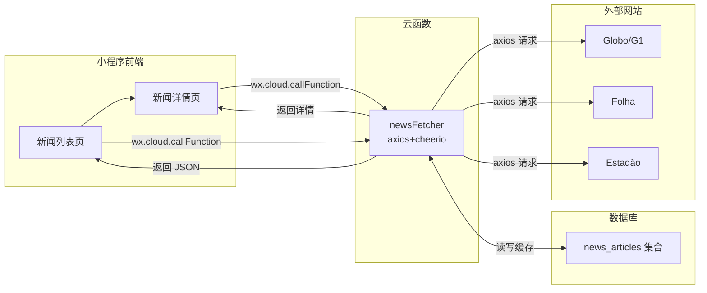
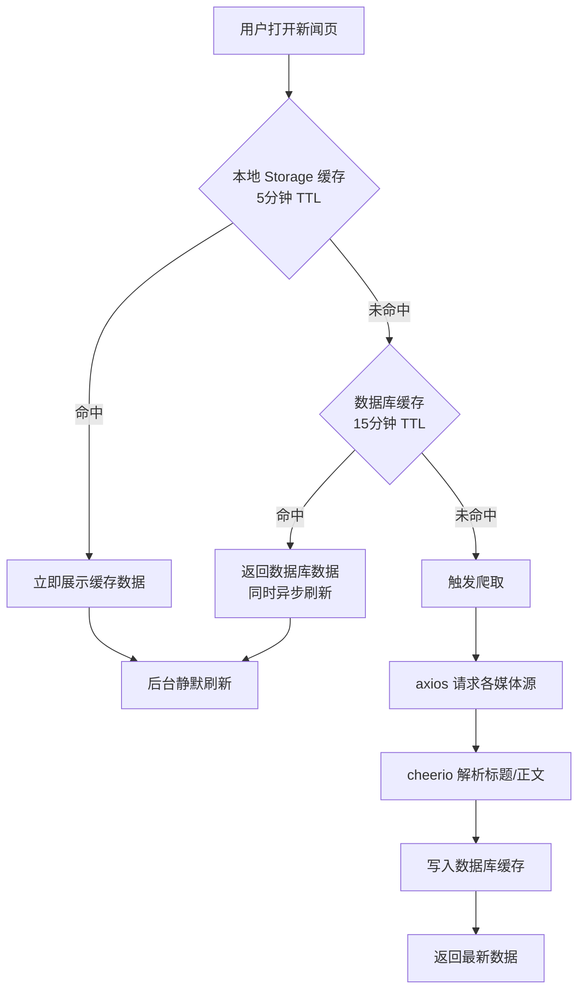

## Product Overview

在小程序 TabBar 的"审批中心"和"小绿书"之间新增"新闻"Tab，用于展示从巴西主流媒体网站（Globo/G1、Folha、Estadão）爬取的最新新闻。用户可按来源筛选，点击进入详情查看完整文章内容。

## Core Features

- **新闻 TabBar 入口**：在 app.json 的 tabBar.list 中，"审批中心"和"小绿书"之间插入"新闻"项
- **新闻列表页**：展示新闻卡片（标题、摘要、来源、时间、封面图），支持按来源 Tab 筛选，支持下拉刷新和分页加载
- **新闻详情页**：展示完整文章内容（标题、正文、来源标注、发布时间），支持跳转原文
- **云函数爬取+缓存**：newsFetcher 云函数使用 axios+cheerio 抓取巴西媒体新闻，缓存到 news_articles 集合，15分钟 TTL
- **数据库集合**：news_articles 存储抓取的新闻数据，安全规则 ADMINWRITE

## Tech Stack

- **云函数运行时**：Node.js (CloudBase 云函数)
- **HTTP 请求**：axios
- **HTML 解析**：cheerio
- **数据库**：CloudBase NoSQL (news_articles 集合)
- **前端**：微信小程序原生框架 (WXML/WXSS/JS)
- **缓存策略**：数据库缓存 + 本地 Storage 缓存（5 分钟）

## Implementation Approach

### 架构设计



### 缓存策略（两级缓存）



### 云函数 Actions 设计

| Action | 说明 | 参数 |
| --- | --- | --- |
| `list` | 获取新闻列表（带缓存） | `page, pageSize, source` |
| `detail` | 获取新闻详情 | `articleId` |
| `refresh` | 强制刷新（供定时触发器调用） | 无 |


### 爬取策略

- 每个媒体源定义独立的解析器函数（parseGlobo、parseFolha、parseEstadao）
- 首页提取文章链接列表，然后逐个进入详情页提取正文
- 每次每源最多抓取 5 篇最新文章
- 请求间加 1-2 秒随机延迟，设置随机 User-Agent
- 去重逻辑：以 sourceUrl 为唯一标识，已存在则跳过

## Implementation Notes

### 云函数规范

- 遵循项目统一 success/fail 返回格式
- 集合引用集中定义
- axios timeout 设为 10s，云函数超时设为 60s
- cheerio 解析需处理编码（巴西网站均为 UTF-8）
- 错误处理：单个源失败不影响其他源，返回部分结果

### 数据库规范

- 集合名：`news_articles`（小写+下划线+复数）
- 安全规则：`ADMINWRITE`（云函数写入，所有用户可读）
- 需创建组合索引：`idx_source_scrapedAt`（source 升序 + scrapedAt 降序）
- 过期清理：refresh 时删除超过 24 小时的旧数据

### 前端规范

- 列表页使用本地 Storage 缓存（5 分钟 TTL），参照 greenbook 的缓存模式
- 分页加载参照 pagination.js behavior 或自定义分页
- 详情页使用 rich-text 组件渲染 HTML 正文（cheerio 提取的原始 HTML 需清洗 script/style 标签）
- 页面 json 启用 `enablePullDownRefresh: true`

### 反爬风险控制

- 设置合理 User-Agent 模拟浏览器
- 请求间 1-2 秒随机延迟
- 数据库缓存 15 分钟，减少请求频率
- 定时触发器每 15 分钟自动刷新（可选）

## Directory Structure

```
d:/WechatPrograms/ceshi/
├── cloudfunctions/
│   └── newsFetcher/
│       ├── index.js            # [NEW] 新闻爬取云函数，包含 list/detail/refresh actions
│       └── package.json        # [NEW] 依赖：wx-server-sdk, axios, cheerio
├── miniprogram/
│   ├── image/
│   │   ├── news1.png           # [NEW] 新闻 TabBar 图标（未选中态）
│   │   └── news1-s.png         # [NEW] 新闻 TabBar 图标（选中态）
│   ├── pages/
│   │   └── office/
│   │       ├── news/
│   │       │   ├── news.js     # [NEW] 新闻列表页逻辑（Tab筛选、分页、缓存）
│   │       │   ├── news.json   # [NEW] 页面配置
│   │       │   ├── news.wxml   # [NEW] 新闻列表页模板
│   │       │   └── news.wxss   # [NEW] 新闻列表页样式
│   │       └── news-detail/
│   │           ├── news-detail.js     # [NEW] 新闻详情页逻辑
│   │           ├── news-detail.json   # [NEW] 页面配置
│   │           ├── news-detail.wxml   # [NEW] 新闻详情页模板
│   │           └── news-detail.wxss   # [NEW] 新闻详情页样式
│   └── app.json                # [MODIFY] tabBar.list 中插入新闻项
├── .codebuddy/docs/
│   └── DATABASE_COLLECTIONS_REFERENCE.md  # [MODIFY] 新增 news_articles 集合定义
```

## Key Code Structures

### news_articles 集合字段结构

```javascript
{
  _id: String,              // 记录 ID（自动生成）
  title: String,             // 新闻标题
  content: String,           // 新闻正文 HTML（已清洗）
  summary: String,           // 摘要（纯文本，最多200字）
  imageUrl: String,          // 封面图 URL（可选）
  source: String,            // 来源：'globo' | 'folha' | 'estadao'
  sourceName: String,        // 来源显示名：'Globo' | 'Folha' | 'Estadão'
  sourceUrl: String,         // 原文链接（唯一标识，用于去重）
  category: String,          // 分类（从网站提取）
  publishedAt: Number,       // 原文发布时间戳
  scrapedAt: Number,         // 抓取时间戳
  createdAt: Number,         // 记录创建时间戳
  updatedAt: Number          // 记录更新时间戳
}
```

### 云函数入口结构

```javascript
exports.main = async (event, context) => {
  const { action } = event
  try {
    switch (action) {
      case 'list': return await handleList(event)
      case 'detail': return await handleDetail(event)
      case 'refresh': return await handleRefresh(event)
      default: return fail('未知操作', 400)
    }
  } catch (error) {
    console.error('newsFetcher 错误:', error)
    return fail(error.message)
  }
}
```

## Design Style

新闻页面采用"新闻媒体"风格设计，以蓝色系为主色调（区别于小绿书的绿色、首页的蓝色），营造专业、可信赖的新闻阅读氛围。使用卡片式布局展示新闻列表，大图+标题的醒目设计。

## Page Planning

### Page 1: 新闻列表页 (news)

**Block 1 - 自定义导航栏**
固定顶部，深蓝色渐变背景，包含页面标题"巴西新闻"和简洁的搜索图标。

**Block 2 - 来源 Tab 筛选**
横向滚动的来源筛选标签，全部/ Globo/ Folha/ Estadao 四个 Tab，胶囊形按钮样式，选中态为深蓝色。

**Block 3 - 新闻卡片列表**
纵向滚动列表，每张卡片包含：左侧封面图（固定宽高比），右侧标题（2行截断）+ 摘要（1行）+ 来源标签 + 时间。卡片之间有分割线。

**Block 4 - 加载状态与空状态**
加载中显示骨架屏，底部显示"加载更多"或"没有更多了"，无数据时显示报纸图标 + 提示文案。

### Page 2: 新闻详情页 (news-detail)

**Block 1 - 自定义导航栏**
固定顶部，深蓝色渐变，显示返回箭头和来源名称。

**Block 2 - 文章头部**
大标题（粗体，较大字号），发布时间 + 来源标签，封面图（如有，全宽展示）。

**Block 3 - 文章正文**
使用 rich-text 组件渲染清洗后的 HTML，合理行间距和字号，段间距清晰。

**Block 4 - 底部操作栏**
固定底部，包含"阅读原文"按钮（跳转到原文 WebView 或复制链接）。

## Agent Extensions

### MCP

- **CloudBase MCP**
- Purpose: 创建 news_articles 数据库集合、配置安全规则（ADMINWRITE）、创建组合索引
- Expected outcome: 数据库集合就绪，安全规则和索引正确配置

### Skill

- **cloudbase (downloadRemoteFile)**
- Purpose: 下载新闻 TabBar 图标（news1.png 和 news1-s.png），PNG 格式，需符合微信小程序 TabBar 图标规范（81x81px 建议）
- Expected outcome: 两张 TabBar 图标文件就位

### Integration

- **tcb**
- Purpose: 云函数 newsFetcher 的创建和部署验证
- Expected outcome: 云函数成功创建并可用