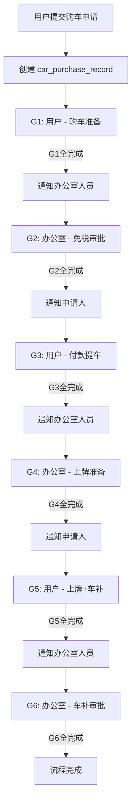

## 产品概述

基于 Excel 表格中「国产车（当地车）」购车流程，在小程序中实现一套 **Checklist 工作流模式** 的购车管理功能。不使用 workflowEngine 审批中心引擎，改为独立云函数 + 纵向进度时间线展示。流程按 6 个组划分，**组内步骤并行执行、组间顺序流转**，每组全部完成后自动推送通知给下一组的责任人。

## 核心功能

### 功能一：6 组并行 Checklist 流程

每组内的步骤可按任意顺序完成（并行），一组全部打钩完成后自动通知下一组责任人。

**第1组【用户】— 购车准备（4步并行）：**

| 步骤 | 名称 | 输入类型 |
| --- | --- | --- |
| 1.1 | 选定车型 | 文本输入（必填） |
| 1.2 | 馆内购车申请 | 文本输入（预留字段） |
| 1.3 | 签订合同并付定金 | 上传：合同照片 + 付定金截图 |
| 1.4 | 取得外交官证 | 上传：证件正反面照片 |


**第2组【办公室】— 免税审批（5步并行）：**

| 步骤 | 名称 | 输入类型 |
| --- | --- | --- |
| 2.1 | 制作《免税购车申请表》《居住证明》《税务委托书》 | 模板生成 + 下载 |
| 2.2 | 提交上述文件至外交部特豁处审批 | 打钩确认 |
| 2.3 | 《免税购车申请表》获外交部批复 | 打钩确认 |
| 2.4 | 《免税购车申请表》交税务部审批 | 打钩确认 |
| 2.5 | 《免税购房申请表》获税务部批复 | 打钩确认 |


**第3组【用户】— 付款提车（2步并行）：**

| 步骤 | 名称 | 输入类型 |
| --- | --- | --- |
| 3.1 | 车行通知付全款 | 上传：合同PDF + 付款凭证 + 发票 |
| 3.2 | 完成提车 | 文本备注（请将车架号拓印交办公室） |


**第4组【办公室】— 上牌准备（5步并行）：**

| 步骤 | 名称 | 输入类型 |
| --- | --- | --- |
| 4.1 | 协助办理车险 | 打钩确认 |
| 4.2 | 填写《上牌申请表》Renavam | 打钩确认 |
| 4.3 | Renavam交外交部审批 | 打钩确认 |
| 4.4 | Renavam获外交部批复 | 打钩确认 |
| 4.5 | 约定上牌日期 | 日期选择器 |


**第5组【用户】— 上牌+车补材料（2步并行）：**

| 步骤 | 名称 | 输入类型 |
| --- | --- | --- |
| 5.1 | 前往上牌 | 文本备注（携带证件原件+车辆到馆前门） |
| 5.2 | 填写《车补申请表》 | 文本/上传 |


**第6组【办公室】— 车补审批（1步）：**

| 步骤 | 名称 | 输入类型 |
| --- | --- | --- |
| 6.1 | 向国内申请车补 | 打钩确认 → 标记完成 |


### 功能二：自动通知机制

- 第1组全完成 → 推送通知给所有「办公室」部门人员
- 第2组全完成 → 推送通知给该申请人
- 第3组全完成 → 推送通知给所有「办公室」部门人员
- 第4组全完成 → 推送通知给该申请人
- 第5组全完成 → 推送通知给所有「办公室」部门人员
- 第6组全完成 → 推送通知给该申请人（流程结束）

### 功能三：双 Tab 页面布局

1. **「我的购车」Tab**（所有有权限用户可见）：显示自己发起的购车记录列表，点击查看详情和纵向 Checklist 进度时间线，对自己的组内步骤进行打钩/上传操作
2. **「购车管理」Tab**（仅 department === '办公室' 的人员可见）：显示所有人的购车申请及进度列表，查看详情并对办公室负责的步骤进行打钩操作

### 权限配置

- `enabledRoles`: ['馆领导', '部门负责人', '馆员', '工勤']
- 部门为【办公室】的人员额外拥有「购车管理」Tab 的查看权限

### 功能四：文件附件管理

每个步骤支持图片上传（最多9张）、PDF文件上传、文本备注输入、已上传文件的预览和下载。

## Tech Stack Selection

- **前端**: 微信小程序原生框架（WXML/WXSS/JS），复用现有项目架构
- **后端**: 云函数（wx-server-sdk），新建独立云函数 `carPurchase`
- **数据库**: CloudBase NoSQL 文档数据库，新增集合 `car_purchase_records`
- **存储**: CloudBase 云存储（`car-purchase/` 目录下）
- **样式**: WXSS，参考 medical-application 布局模式但采用紫色调主题以示区分
- **分页**: 复用 `paginationBehavior` 行为
- **时间工具**: 复用 `common/utils.js` 格式化函数
- **组件**: datetime-picker 组件（已集成）

## Implementation Approach

采用 **独立 Checklist 引擎** 架构（非 workflowEngine）。核心设计思路：

1. **数据模型**：每条购车记录为一个文档，内嵌 `groups[]` 数组，每个 group 包含 `steps[]` 数组，每个 step 包含状态、附件、操作人等信息
2. **组间流转逻辑**：每次 toggleStep 后检查当前组是否全部完成，若完成则推进 currentGroup 并写入 notifications 集合推送通知
3. **并发安全**：toggleStep 使用乐观锁（updatedAt 版本校验）防止并发冲突
4. **文件管理**：每个步骤的附件存放在云存储 `car-purchase/{recordId}/{stepKey}/` 目录下，数据库中存储 fileID 数组
5. **模板文书生成**：第2组步骤2.1 的免税申请表等文书，初期预留接口结构，后续可通过云函数根据模板数据填充生成

### 架构设计



## Implementation Notes

1. **性能优化**：getMyList/getAllList 只返回概要信息（车型、当前组、各组完成度），getDetail 才返回完整 groups+steps 数据；列表查询对 applicantOpenid 和 status 建立复合索引
2. **通知防重复**：每次组切换时在记录中记录 notifiedGroups 数组，避免同组重复通知
3. **向后兼容**：完全独立的新增功能，不影响现有任何模块
4. **部署顺序**：先创建集合 → 部署云函数 → 更新前端代码 → 配置权限
5. **安全规则**：`car_purchase_records` 使用 ADMINWRITE 规则；实际写权限在云函数中校验：只有申请人可操作 staff 组步骤，只有 office 组人员可操作 office 组步骤
6. **文件清理**：删除记录时需同步清理云存储中的附件文件

## Directory Structure

```
d:/WechatPrograms/ceshi/
├── cloudfunctions/
│   └── carPurchase/                     # [NEW] 新建云函数
│       ├── index.js                     # 主入口：create/getMyList/getAllList/getDetail/toggleStep/uploadAttachments/updateStepRemark
│       └── package.json                 # 云函数配置
├── miniprogram/
│   ├── pages/office/
│   │   └── car-purchase/                # [NEW] 新建页面（4个文件）
│   │       ├── car-purchase.js          # 页面逻辑：双tab/paginationBehavior/弹窗表单/checklist时间线/图片上传
│   │       ├── car-purchase.wxml        # 页面模板：渐变头部/tab栏/列表区/弹窗/纵向时间线
│   │       ├── car-purchase.wxss        # 紫色主题样式(#7C3AED)/卡片布局/时间线CSS/弹窗动画
│   │       └── car-purchase.json        # 页面配置
│   └── app.json                         # [MODIFY] pages数组添加路由
├── miniprogram/pages/office/home/
│   └── home.js                          # [MODIFY] quickActions/handleQuickAction/loadPermissionCache
└── cloudfunctions/dbManager/
    └── index.js                         # [MODIFY] DB_COLLECTIONS添加car_purchase_records
```

## Key Code Structures

### 云函数 Action 设计

```javascript
// carPurchase/index.js - exports.main action 分发
exports.main = async (event, context) => {
  const { action } = event
  switch (action) {
    case 'create':      return await createRecord(event)
    case 'getMyList':   return await getMyList(event)
    case 'getAllList':  return await getAllList(event)
    case 'getDetail':   return await getDetail(event)
    case 'toggleStep':  return await toggleStep(event)
    case 'uploadAttachments': return await uploadAttachments(event)
    case 'updateStepRemark': return await updateStepRemark(event)
    default: return fail('未知操作', 400)
  }
}
```

### 数据结构核心定义

```javascript
// car_purchase_records 集合文档结构
{
  _id: String,
  applicantOpenid: String,
  applicantName: String,
  applicantDepartment: String,
  carModel: String,
  status: String,                // active / completed
  currentGroup: Number,          // 当前所处组编号 1-6
  notifiedGroups: [Number],      // 已通知过的组（防重复）
  
  groups: [
    {
      groupId: 1,
      groupName: '购车准备',
      groupOwner: 'staff',       // staff | office
      steps: [
        {
          stepKey: '1_1',
          title: '选定车型',
          inputType: 'text',     // text | checkbox | date | upload | template | remark
          required: true,
          status: 'pending',     // pending | done
          value: '',
          attachments: [],       // [{fileID, fileName, fileType, uploadedAt}]
          completedAt: null,
          operatorId: null,
          operatorName: null,
          remark: ''
        }
      ]
    }
  ],
  
  createdAt: Timestamp,
  updatedAt: Timestamp
}
```

## 设计风格

采用现代企业级办公应用风格，以 **紫色系** 作为主色调（区别于医疗申请的蓝色 #2563EB 和护照管理的橙色 #D97706），整体 UI 参照 medical-application 的布局模式（渐变头部 + 卡片列表 + 底部弹出弹窗），在详情区域引入 **纵向 Checklist 时间线** 作为核心视觉元素。

## 页面规划（3 个视图）

### 视图一：主页面（双 Tab 布局）

**Block 1 — 渐变色头部**
深紫色渐变背景（#7C3AED → #6D28D9 → #8B5CF6），左侧大标题"购车管理"，副标题"国产车购车流程追踪"。与医疗申请页面风格统一但色调区分。

**Block 2 — Tab 切换栏**
固定在头部下方，两个 tab："我的购车"和"购车管理"。选中态紫色下划线+加粗文字，未选中态灰色。仅当用户 department 为"办公室"时显示"购车管理"tab。

**Block 3 — 列表区域**
卡片式列表，每张卡片包含：车型名称（粗体大字）、当前所在组标签（如"G2-免税审批"）、整体进度百分比横条、最后更新时间相对文本。空状态居中显示汽车图标+"暂无购车记录"引导文案。

**Block 4 — 浮动添加按钮**
右下角悬浮圆形按钮（仅在"我的购物"tab 且当前用户有权限时显示），"+" 图标，点击弹出购车申请表单。

### 视图二：购车申请弹窗（底部弹出，60vh）

**Block 1 — 弹窗头部**：标题"添加购车申请"+关闭按钮
**Block 2 — 表单区域**：车型输入框（必填）、馆内购车申请（选填预留）。下方折叠面板展示完整6组流程预览
**Block 3 — 底部操作**："提交申请"按钮（紫色渐变）

### 视图三：详情弹窗（底部弹出，85vh）— 核心 UI

**Block 1 — 弹窗头部**：标题"购车详情"+关闭按钮+当前组标签badge
**Block 2 — 基础信息区**：键值对列表展示申请人、部门、车型、申请时间、当前状态
**Block 3 — Checklist 纵向时间线（核心交互区）**：

- 按组分组展示，每组带颜色的分组标题栏（已完成=绿色/进行中=紫色/待办=灰色）
- 左侧垂直连接线+圆形节点（已完成实心绿色✅ / 进行中脉冲橙色🔄 / 待办空心灰色⚪）
- 右侧步骤卡片：名称+状态标识+输入内容预览（文本缩略/缩略图/附件数badge/日期文本）+对应责任方可见操作按钮
- 组间虚线分隔并标注箭头指向下一组
**Block 4 — 步骤编辑弹层**（点击步骤操作时弹出）：
根据 inputType 动态渲染：text输入框 / checkbox打钩开关 / date日期选择器 / upload图片选择器(最多9张)+已上传网格预览(可点击预览大图/删除) / remark多行文本域
**Block 5 — 操作日志区**：折叠面板，展开显示所有步骤变更历史

### SubAgent

- **code-explorer**
- Purpose: 在实现前深入探索 medical-application 完整 JS/WXML/WXSS 代码用于精确复刻 UI 模式、home.js 中 handleQuickAction 的完整分支结构确保正确插入新车购路由、notification 写入方式确保通知推送代码一致
- Expected outcome: 提供精确的代码片段参考和文件偏移量，确保新代码与现有模式完全一致

### Skill

- **cloudbase**
- Purpose: 创建 NoSQL 集合 car_purchase_records 并配置安全规则（ADMINWRITE）和索引；部署 carPurchase 云函数到云端
- Expected outcome: 成功创建集合并具备正确的读写权限和索引配置；云函数成功部署并可调用