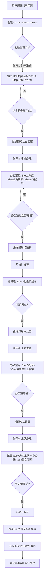

## 产品概述

基于 Excel 表格中「国产车（当地车）」购车流程的 11 个步骤，在小程序中实现一套 **Checklist 模式** 的购车管理功能。不使用 workflowEngine 工作流引擎，改用纯 Checklist 打钩模式，按步骤顺序区分「馆员组」和「办公室组」两组 Todo，一组全部完成时自动向另一组推送通知。

## 核心功能

### 功能一：购车申请与进度跟踪（Checklist 模式）

11 个步骤严格按顺序执行，分为两个责任分组：

**馆员组（申请人操作）：**

| 步骤序号 | 步骤名称 | 说明 |
| --- | --- | --- |
| 1 | 选车签合同付订金 | 到馆后选车型、馆批购车申请、签合同付订金（1月内） |
| 2 | 取证件号通知办 | 取得CD开头外交官证件号后通知办公室外勤启动购车手续 |
| 5 | 付清全款提车 | 税务部批复后退车行、付清全款、排产提车（1-2周） |
| 7 | 约定上牌 | 《上牌申请表》批复后提前与办公室约定工作日上午上牌 |
| 8 | 携带证件车辆到场 | 上牌日携带外交官证原件、将车辆开至使馆前门 |
| 9 | 提交车补申请材料 | 上牌后填写《车补申请表》+合同+订金凭证+CRLV交办公室 |


**办公室组（办公室部门人员操作）：**

| 步骤序号 | 步骤名称 | 说明 |
| --- | --- | --- |
| 2-响应 | 启动购车手续 | 收到馆员通知后启动购车手续 |
| 3 | 制作免税申请文件 | 协助制作《免税购车申请表》《居住证明》《税务委托书》，交外交部特豁处审批（15-20工作日） |
| 4 | 税务部跟进审批 | 免税表批复后交税务部审批（1-2月），品牌税务代理每周跟进 |
| 5-配合 | 通知付全款提车 | 批复后退车行并通知馆员付清全款 |
| 6 | 办保险填上牌表 | 收发票+车架号→协助办保险→填写《上牌申请表》Renavam→交外交部审批（约1月） |
| 8-配合 | 陪同办理上牌 | 陪同馆员办理车检、信息登记和现场上牌 |
| 10 | 转交车补审批 | 收到车补申请材料后转交审批流程 |


**自动通知机制：**

- 当馆员组的当前阶段所有步骤全部打钩完成时，系统自动向办公室人员推送通知：「XX馆员的购车流程已进入[下一阶段名称]，请处理」
- 当办公室组的当前阶段所有步骤全部打钩完成时，系统自动向该馆员推送通知：「您的购车流程已进入[下一阶段名称]，请处理」

### 功能二：双 Tab 页面布局

1. **「我的购车」Tab**（所有有权限用户可见）：显示自己发起的购车记录列表，点击查看详情和 Checklist 进度，对自己的步骤进行打钩操作
2. **「购车管理」Tab**（仅部门=办公室的人员可见）：显示所有人的购车申请及进度列表，查看详情并对办公室负责的步骤进行打钩操作

### 权限配置

- `enabledRoles`: ['馆领导', '部门负责人', '馆员', '工勤']
- 部门为【办公室】的人员额外拥有「购车管理」Tab 的查看权限

## 技术栈选择

- **前端**: 微信小程序原生框架（WXML/WXSS/JS），复用现有项目架构
- **后端**: 云函数（wx-server-sdk），新建独立云函数 carPurchase
- **数据库**: CloudBase NoSQL 文档数据库，新增集合 car_purchase_records
- **样式**: WXSS，参考 medical-application 布局模式但采用紫色调主题以示区分
- **分页**: 复用 paginationBehavior 行为
- **时间工具**: 复用 common/utils.js 格式化函数

## 实现方案

### 架构设计：纯 Checklist 模式（非 workflowEngine）

核心思路是新建独立的集合和云函数，不依赖 workflowEngine 引擎。数据模型围绕「购车记录 + Checklist 步骤 + 双组责任划分」设计。



### 数据结构设计

**集合：car_purchase_records**

每条记录包含：

```javascript
{
  _id: String,                    // 记录ID
  applicantOpenid: String,        // 申请人openid
  applicantName: String,          // 申请人姓名
  applicantDepartment: String,    // 申请人部门
  carModel: String,               // 车型
  dealership: String,             // 车行
  status: String,                 // overall status: active / completed
  currentPhase: Number,           // 当前所处阶段 1-6
  
  // 11个checklist步骤，每个步骤含状态和归属组
  checklist: {
    // ===== 阶段1: 购车准备 =====
    step1: {                      // 馆员: 选车签合同付订金
      group: 'staff', order: 1, phase: 1,
      title: '选车型、签合同、付订金',
      detail: '到馆后及时选好车型，取得馆批购车申请后与车行签订合同并支付订金',
      status: 'pending',          // pending / done
      completedAt: null,
      operatorId: null,
      operatorName: null,
      remark: ''
    },
    step2_notify: {               // 馆员: 取CD证件号通知办公室
      group: 'staff', order: 2, phase: 1,
      title: '取得外交官证件号并通知办公室',
      detail: '取得CD开头外交官证件号后通知办公室外勤启动购车手续',
      status: 'pending', completedAt: null, ...
    },
    step2_resp: {                 // 办公室: 收到通知启动手续
      group: 'office', order: 3, phase: 2,
      title: '收到通知，启动购车手续',
      status: 'pending', completedAt: null, ...
    },
    
    // ===== 阶段2: 免税审批 =====
    step3: {                      // 办公室: 制作免税申请文件
      group: 'office', order: 4, phase: 2,
      title: '制作《免税购车申请表》等文件并交外交部审批',
      detail: '协助制作免税购房申请表、居住证明、税务委托书，交外交部特豁处审批（约15-20工作日）',
      status: 'pending', completedAt: null, ...
    },
    step4: {                      // 办公室: 税务部跟进审批
      group: 'office', order: 5, phase: 2,
      title: '交税务部审批并跟进',
      detail: '免税表批复后交税务部审批（约1-2个月），品牌税务代理每周跟进',
      status: 'pending', completedAt: null, ...
    },
    
    // ===== 阶段3: 提车 =====
    step5_pay: {                  // 办公室配合: 通知付全款
      group: 'office', order: 6, phase: 3,
      title: '通知馆员付清全款提车',
      detail: '批复后退车行，通知馆员付清车款安排排产提车',
      status: 'pending', completedAt: null, ...
    },
    step5_pickup: {               // 馆员: 付全款提车
      group: 'staff', order: 7, phase: 3,
      title: '付清全款并提车',
      detail: '付清车款，安排车辆排产并预约提车（约1-2周）',
      status: 'pending', completedAt: null, ...
    },
    
    // ===== 阶段4: 上牌准备 =====
    step6: {                      // 办公室: 办保险+填上牌表
      group: 'office', order: 8, phase: 4,
      title: '收发票车架号，办保险，填《上牌申请表》交外交部审批',
      detail: '收到发票和车架号拓印后协助办理保险，填写上牌申请表交外交部审批（约1个月）',
      status: 'pending', completedAt: null, ...
    },
    
    // ===== 阶段5: 上牌办理 =====
    step7_schedule: {             // 馆员: 约定上牌
      group: 'staff', order: 9, phase: 5,
      title: '与办公室约定上牌日期',
      detail: '上牌表批复后提前与办公室约定任意工作日上午办理上牌',
      status: 'pending', completedAt: null, ...
    },
    step8_accompany: {            // 办公室配合: 陪同上牌
      group: 'office', order: 10, phase: 5,
      title: '陪同办理车检、信息登记和现场上牌',
      detail: '携带外交官证原件和车辆到使馆前门，陪同办理现场上牌（制牌费约210雷亚尔自费）',
      status: 'pending', completedAt: null, ...
    },
    
    // ===== 阶段6: 车补 =====
    step9: {                      // 馆员: 提交车补材料
      group: 'staff', order: 11, phase: 6,
      title: '填写《车补申请表》并提交材料',
      detail: '上牌后填写车补申请表，连同购车合同、订金凭证、CRLV交办公室',
      status: 'pending', completedAt: null, ...
    },
    step10: {                     // 办公室: 转交车补审批
      group: 'office', order: 12, phase: 6,
      title: '转交车补申请审批',
      detail: '收到车补材料后转交国内审批',
      status: 'pending', completedAt: null, ...
    }
  },
  
  createdAt: Timestamp,
  updatedAt: Timestamp
}
```

**阶段流转逻辑（6个阶段）：**

| 阶段 | 名称 | 馆员步骤 | 办公室步骤 | 完成后触发 |
| --- | --- | --- | --- | --- |
| 1 | 购车准备 | step1, step2_notify | - | 通知办公室 |
| 2 | 免税审批 | - | step2_resp, step3, step4 | 通知馆员 |
| 3 | 提车 | step5_pickup | step5_pay | 通知办公室 |
| 4 | 上牌准备 | - | step6 | 通知馆员 |
| 5 | 上牌办理 | step7_schedule | step8_accompany | 通知馆员 |
| 6 | 车补 | step9 | step10 | 标记完成 |


### 关键实现细节

1. **云函数 carPurchase 的 Action 设计**：

| Action | 说明 | 触发方 |
| --- | --- | --- |
| `create` | 创建购车申请记录（填入车型、车行） | 馆员 |
| `getMyList` | 分页获取我的购车记录 | 馆员 |
| `getAllList` | 分页获取所有购车记录（办公室专用） | 办公室人员 |
| `getDetail` | 获取单条记录详情（含完整checklist） | 双方 |
| `toggleStep` | 切换某个步骤的完成状态（打钩/取消） | 对应责任方 |


2. **toggleStep 核心逻辑**：

- 校验当前用户是否为该步骤的责任方（group 匹配）
- 更新步骤 status 为 done/pending
- 设置 completedAt 和 operator 信息
- 检查当前阶段的同组步骤是否全部完成
- 若全部完成 → 向另一组推送 notifications 记录
- 推送通知方式：直接写入 `notifications` 集合（复用 passportExpiryChecker 的模式）

3. **办公室人员识别**：通过 `office_users` 集合查询 `department === '办公室'`

4. **通知目标查询**：当需要通知「办公室」时，查询 office_users 中 department === '办公室' 且 status === 'approved' 的所有用户的 openid，逐条写入 notifications；当需要通知「馆员」时，直接使用记录中的 applicantOpenid

## 目录结构

```
d:/WechatPrograms/ceshi/
├── cloudfunctions/
│   └── carPurchase/                     # [NEW] 新建云函数
│       ├── index.js                     # 云函数主入口，处理 create/getMyList/getAllList/getDetail/toggleStep
│       └── package.json                 # 云函数配置
├── miniprogram/
│   ├── pages/office/
│   │   └── car-purchase/                # [NEW] 新建页面（4个文件）
│   │       ├── car-purchase.js          # 页面逻辑：双tab切换、分页加载、弹窗表单、checklist交互
│   │       ├── car-purchase.wxml        # 页面模板：渐变头部、tab栏、列表区、弹窗表单、弹窗详情含checklist
│   │       ├── car-purchase.wxss        # 页面样式：紫色渐变主题(#7C3AED)、卡片布局、弹窗动画、步骤条样式
│   │       └── car-purchase.json        # 页面配置：引用datetime-picker组件、下拉刷新、触底距离
│   └── app.json                         # [MODIFY] pages数组添加新页面路径
├── miniprogram/pages/office/home/
│   └── home.js                          # [MODIFY] quickActions添加入口、handleQuickAction添加路由、loadPermissionCache添加featureKey
└── cloudfunctions/dbManager/
    └── index.js                         # [MODIFY] DB_COLLECTIONS数组添加car_purchase_records
```

## 实现注意事项

1. **性能优化**：getDetail 和 getAllList 使用合理的字段筛选，避免返回过大的 checklist 数据。列表接口只返回概要信息（车型、车行、当前阶段、完成度百分比），详情接口才返回完整 checklist
2. **并发安全**：toggleStep 操作中使用事务或乐观锁防止重复提交
3. **向后兼容**：不影响现有任何功能模块，完全独立的新增功能
4. **部署顺序**：先部署云函数 carPurchase → 再更新前端代码
5. **集合安全规则**：car_purchase_records 使用 READONLY 规则（所有认证用户可读，仅创建者和管理员可写），实际写操作通过云函数控制权限
6. **通知防重复**：每次阶段切换时检查是否已发送过该阶段的通知，避免重复推送

## 整体设计风格

采用现代简洁的企业级办公应用设计风格，以**紫色系**作为主色调（区别于医疗申请的蓝色 #2563EB 和护照管理的橙色），营造专业且高效的购车管理氛围。

### 页面规划（3个核心视图）

#### 视图一：主页面（含双 Tab）

**Block 1 - 渐变色头部区域**
深紫色渐变背景（#7C3AED → #6D28D9 → #8B5CF6），左侧大标题"购车管理"，右侧副标题"国产车购车流程追踪"。视觉上与医疗申请页面风格一致但色调不同。

**Block 2 - Tab 切换栏**
固定在内容区顶部，两个 tab："我的购车"和"购车管理"。选中态为紫色下划线+文字加粗，未选中态为灰色文字。仅当用户部门为"办公室"时才显示"购车管理"tab，否则隐藏。

**Block 3 - 列表区域**
卡片式列表展示购车记录。每张卡片包含：车型名称（粗体）、车行名、当前阶段标签（如"阶段2-免税审批"）、整体进度圆环或百分比条、最后更新时间。

- 空状态时居中显示汽车图标+引导文案
- 加载中显示骨架屏或 loading 文字

**Block 4 - 浮动添加按钮**
右下角悬浮按钮（仅在"我的购物"tab显示），"+" 图标，点击弹出购车申请表单。

#### 视图二：购车申请弹窗（底部弹出）

**Block 1 - 弹窗头部**
标题"添加购车申请"+关闭按钮。

**Block 2 - 表单区域**
两个字段：车型（输入框，必填）、车行名称（输入框，必填）。下方展示11步流程预览（只读折叠面板），让用户了解完整流程。

**Block 3 - 底部按钮**
"提交申请"按钮（紫色渐变），loading 态禁用。

#### 视图三：详情弹窗（底部弹出，85vh 高度）

**Block 1 - 弹窗头部**
标题"购车详情"+关闭按钮。

**Block 2 - 基础信息区**
申请人、车型、车行、申请时间、当前状态等键值对展示。

**Block 3 - Checklist 进度时间线（核心交互区）**
垂直时间线布局，左侧为连接线和节点圆点，右侧为步骤卡片。按阶段分组显示标题（如"阶段1 - 购车准备"）。

- 已完成步骤：绿色实心圆点 ✅ + 步骤名称 + 完成时间 + 操作人
- 进行中步骤：橙色脉冲圆点 🔄 + 步骤名称 + 可操作的打钩按钮
- 待办步骤：灰色空心圆点 ⚪ + 步骤名称（置灰显示）
- 非本人责任的步骤：只读显示，无打钩按钮
- 每个步骤可展开查看详细说明文字（detail 字段内容）

**Block 4 - 操作日志区**
时间线形式展示所有步骤变更历史（谁在什么时间完成了什么步骤）。

### 交互设计要点

- 卡片点击有轻微缩放反馈（scale 0.98）
- 打钩操作有成功 toast 提示
- 阶段切换时有通知提示
- 弹窗从底部滑入滑出（300ms ease 过渡动画）
- 下拉刷新 + 触底加载更多（复用 paginationBehavior）

## Agent Extensions

### SubAgent

- **code-explorer**
- Purpose: 在实现前深入探索现有代码的具体实现细节（medical-application 的完整 JS 逻辑、home.js 中 handleQuickAction 的完整分支结构、notification 集合的数据结构等）
- Expected outcome: 提供精确的代码片段参考和文件偏移量，确保新代码与现有模式完全一致

### Skill

- **cloudbase**
- Purpose: 用于创建新的数据库集合 `car_purchase_records` 并配置正确的安全规则和索引
- Expected outcome: 成功创建集合，具备读写权限和必要的查询索引