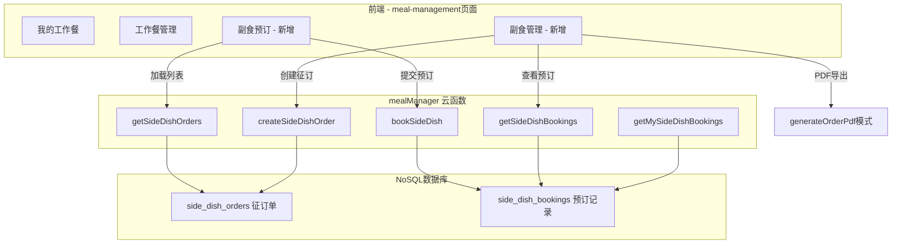

## Product Overview

在现有「餐食管理」页面中新增两个Tab页：【副食预订】和【副食管理】。副食预订面向普通用户（馆领导、部门负责人、馆员、工勤），提供征订单浏览、预订/取消功能；副食管理面向后勤岗位人员（会计主管、会计、出纳、招待员、厨师），提供征订单创建、查看预订明细及PDF导出功能。

## Core Features

### 副食预订Tab（sideOrder）

- **角色权限**：'馆领导', '部门负责人', '馆员', '工勤'
- **列表展示**：以卡片条目方式显示所有有效的副食征订单（标题、副食详情摘要、截止日期、状态标签）
- **预订弹窗**：点击条目弹出详情弹窗，展示征订单完整信息（标题、详情、最大份数、截止日期），底部含加减号计数器调整预订份数（1~maxCount），提交按钮
- **已预订状态**：提交成功后，列表条目上显示"您已预订X份"标记
- **取消预订**：再次打开详情弹窗时，显示当前已预订份数和"取消预订"操作入口
- **过期处理**：截止日期已过的征订单显示"已截止"不可预订

### 副食管理Tab（sideManage）

- **岗位权限**：'会计主管', '会计', '出纳', '招待员', '厨师'
- **新建征订按钮**：页面顶部固定"副食征订"按钮，点击弹出表单
- **新建表单字段**：标题（文本输入）、副食详情（多行文本）、最大预订份数（加减号调整，默认1）、截止日期（datetime-picker选择）
- **征订单列表**：下方以卡片形式展示所有征订单（包含自己创建的和他人的）
- **预订详情查看**：点击征订单卡片弹出详情弹窗，展示所有已预订人员的姓名和预订份数列表
- **PDF导出**：预订详情弹窗内提供导出按钮，将预订清单导出为PDF文件供预览/分享

## Tech Stack

- **前端框架**：微信小程序原生框架（WXML/WXSS/JS）
- **后端**：CloudBase 云函数（Node.js + wx-server-sdk）
- **数据库**：CloudBase NoSQL（文档数据库）
- **PDF生成**：pdfkit（复用现有 generateOrderPdf 模式）

## Tech Architecture

### 系统架构

- **架构模式**：在现有 meal-management 页面扩展 Tab 体系（从2个Tab增至4个Tab），复用现有云函数 mealManager 扩展新 action
- **数据流**：前端页面 ↔ mealManager 云函数 ↔ NoSQL 集合（新增2个集合）

### 数据模型设计

#### side_dish_orders — 副食征订单集合

| 字段 | 类型 | 说明 |
| --- | --- | --- |
| _id | String | 记录ID（自动生成） |
| title | String | 标题 |
| description | String | 副食详情描述 |
| maxCount | Number | 最大预订份数 |
| deadline | String | 截止日期 YYYY-MM-DD |
| creatorOpenid | String | 创建者openid |
| creatorName | String | 创建者姓名 |
| status | String | 状态: 'active'(有效) | 'expired'(已截止) |
| totalBookedCount | Number | 已被预订总份数（冗余字段便于查询） |
| createdAt | Number | 创建时间戳 |


#### side_dish_bookings — 副食预订记录集合

| 字段 | 类型 | 说明 |
| --- | --- | --- |
| _id | String | 记录ID（自动生成） |
| orderId | String | 关联的征订单 ID |
| openid | String | 预订人openid |
| name | String | 预订人姓名 |
| count | Number | 预订份数 |
| createdAt | Number | 创建时间戳 |
| updatedAt | Number | 更新时间戳（取消时置空或更新） |
| status | String | 'booked'(已预订) | 'cancelled'(已取消) |


### 云函数 Action 扩展（mealManager）

| Action | 说明 | 参数 |
| --- | --- | --- |
| getSideDishOrders | 获取有效征订单列表（副食预订tab用） | 无 |
| createSideDishOrder | 新建征订单（副食管理tab用） | { title, description, maxCount, deadline } |
| bookSideDish | 提交/修改/取消预订 | { orderId, action: 'book'\ | 'cancel', count? } |
| getSideDishBookings | 获取某征订单的所有预订记录（管理端查看+导出） | { orderId } |
| getMySideDishBookings | 获取当前用户的预订汇总（用于列表显示"已预订X份"） | 无 |


### 模块划分

- **数据库层**：2个新集合 + 安全规则配置
- **云函数层**：mealManager 扩展5个action
- **前端页面层**：meal-management 页面扩展2个Tab的内容区、3个新弹窗（预订弹窗/新建征订弹窗/预订详情弹窗）
- **PDF导出层**：复用 generateOrderPdf 模式新建 sideDishOrderPdf 或扩展

### 数据流图



## Implementation Notes

- **安全规则**：两个新集合使用 `ADMINWRITE` 规则（所有用户可读，仅云函数可写），与 meal_subscriptions / meal_adjustments 保持一致
- **截止判断**：前端和云端均做截止日期校验，前端用 utils.parseLocalDate 解析比较
- **幂等性**：bookSideDish 的 book 操作需支持同一用户重复提交时为 update 而非 insert（同一用户对同一征订单只有一条有效 booking 记录）
- **totalBookedCount 冗余维护**：每次 book/cancel 时重新统计并更新 orders 表中的 totalBookedCount
- **PDF导出**：参考 medical-application 页面的 handleExportPdf 模式 + generateOrderPdf 云函数结构，新建 `generateSideDishPdf` 云函数或在现有 pdf 函数中增加类型分支
- **分页**：副食预订和管理列表均支持分页加载，遵循项目 paginationBehavior 规范
- **fields传参修复**：顺带修复之前发现的 datetime-picker fields 绑定问题（单引号JSON字符串 → Mustache数组语法）
- **调试日志清理**：清理 datetime-picker 组件中遗留的 DEBUG console.log

## Directory Structure

```
d:/WechatPrograms/ceshi/
├── cloudfunctions/
│   ├── mealManager/
│   │   └── index.js                          # [MODIFY] 扩展5个副食相关action
│   └── generateSideDishPdf/                  # [NEW] 副食预订PDF导出云函数
│       ├── index.js                          # PDF生成逻辑（参考generateOrderPdf）
│       └── package.json                      # 依赖声明（pdfkit等）
├── miniprogram/
│   └── pages/office/meal-management/
│       ├── meal-management.wxml              # [MODIFY] 新增副食预订/管理Tab内容区 + 3个弹窗
│       ├── meal-management.js                # [MODIFY] 新增Tab权限逻辑、数据加载、事件处理
│       └── meal-management.wxss              # [MODIFY] 新增副食相关样式
└── .codebuddy/docs/
    └── DATABASE_COLLECTIONS_REFERENCE.md     # [MODIFY] 新增2个集合定义
```

## 设计风格

采用项目已有的现代渐变风格，延续餐食管理页面的视觉语言——蓝紫渐变头部背景、圆角胶囊式Tab栏、白色卡片式列表、底部弹出式弹窗。整体风格统一协调，新增Tab不破坏原有视觉体系。

## 页面规划

### 页面1：餐食管理主页面（4个Tab布局）

**Block 1 - 渐变头部区域（已有，微调）**
保持现有渐变蓝色背景头部，标题「餐食管理」，副标题根据activeTab动态变化。Tab栏从2个扩展为4个胶囊按钮，横向滚动或自适应排列。

**Block 2 - 副食预订Tab内容区**

- 顶部提示信息卡片：「以下为当前可预订的副食，点击即可预订」
- 征订单卡片列表：每张卡片左侧彩色标签（有效=绿色/截止=灰色），主体显示标题、副食详情前两行、截止日期、右下角已预订份数角标
- 空状态提示：无征订单时的占位插画

**Block 3 - 副食预订详情弹窗**

- 弹窗标题：征订单标题
- 信息展示区：副食详情全文、最大可订份数、截止日期倒计时
- 预订操作区：加减号计数器（最小1、最大maxCount）、提交按钮
- 已预订状态区（条件显示）：当前已预订份数 + 取消预订红色按钮

**Block 4 - 副食管理Tab内容区**

- 顶部悬浮「+ 副食征订」按钮（圆角渐变按钮，固定在内容区顶部）
- 征订单管理列表：类似副食预订的卡片布局但额外显示创建者名称、已预订人数/总份数统计
- 每张卡片右侧有箭头指示可点击查看详情

**Block 5 - 新建征订单表单弹窗**

- 弹窗标题：「发布副食征订」
- 表单字段：标题输入框、副食详情多行文本域、最大预订份数加减器、截止日期picker
- 底部操作按钮：取消 + 发布

**Block 6 - 预订详情弹窗（管理端）**

- 弹窗标题：「预订名单 - {征订单标题}」
- 统计概览：总预订人数、总预订份数
- 预订人员列表：姓名 + 预订�数的简洁列表项
- 底部操作栏：关闭按钮 + PDF导出按钮（带图标）

### Skill

- **cloudbase**
- Purpose: 用于数据库集合创建和安全规则配置（通过 MCP 工具操作 CloudBase NoSQL）、云函数部署指导
- Expected outcome: 成功创建 side_dish_orders 和 side_dish_bookings 两个集合并配置正确的安全规则和索引

### SubAgent

- **code-explorer**
- Purpose: 在实施过程中搜索项目中其他页面的相似实现模式（如医疗申请的PDF导出流程、其他页面的弹窗交互模式），确保代码一致性
- Expected outcome: 找到可复用的代码模式和最佳实践参考