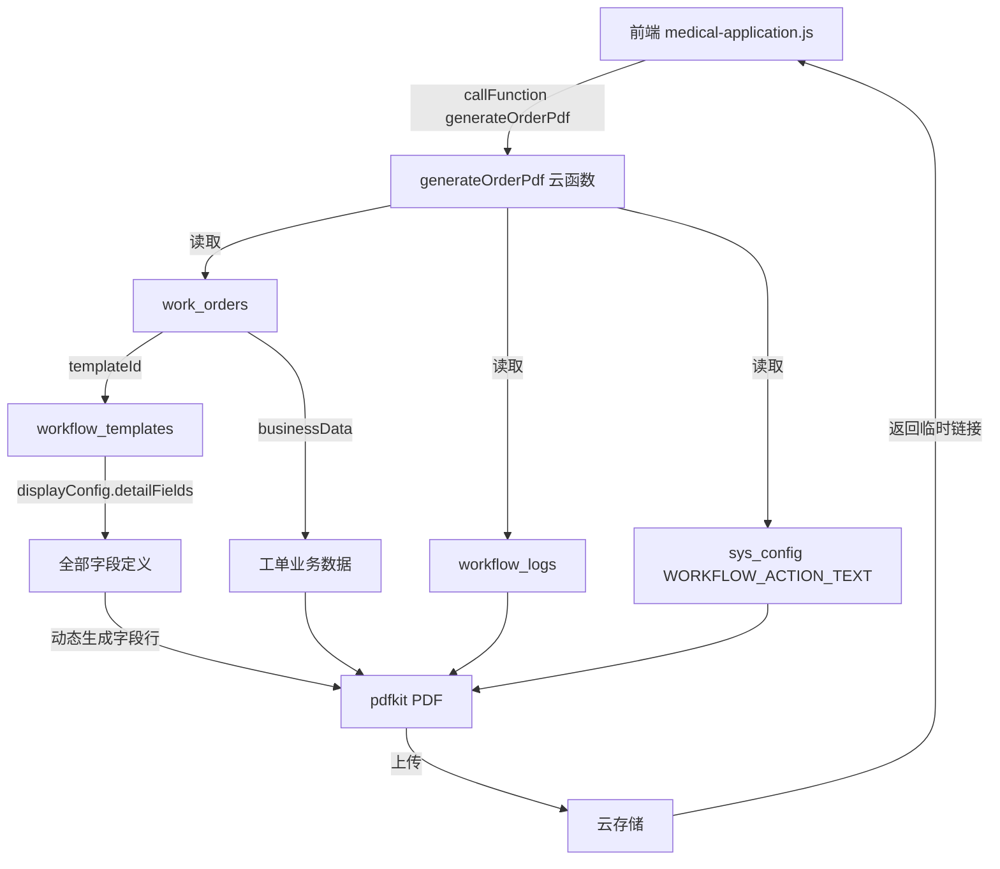

## Product Overview

将 PDF 导出功能从 `medicalApplication` 云函数中抽离为独立的通用云函数 `generateOrderPdf`，通过传入工单 ID 查询对应的工作流模板（`workflow_templates`），实时读取 `displayConfig.detailFields` 来生成 PDF，消除硬编码字段列表，使任意工单类型均可复用同一导出能力。

## Core Features

- 新建独立云函数 `generateOrderPdf`，接收 `orderId` 参数
- 通过 `work_orders.templateId` 查询 `workflow_templates`，从模板的 `displayConfig.detailFields` 读取全部字段定义（不判断 condition，值也为空时也显示字段标签）
- 从 `work_orders.businessData` 中按 `field` 名取值，支持数组自动拼接、空值显示 `-`
- PDF 标题使用模板的 `name`（如"就医申请"），后缀"申请表"
- 审批记录从 `workflow_logs` 查询，actionText 从 `sys_config` 获取
- 修改 `medicalApplication` 云函数，移除内联 `generatePdf` 及相关依赖
- 修改前端 `medical-application.js`，调用新云函数 `generateOrderPdf`

## Tech Stack

- 云函数运行时：Node.js 16（与现有云函数一致）
- PDF 生成：pdfkit（已在 medicalApplication 中使用）
- 中文字体：SourceHanSansSC-Regular.otf（从云存储下载到 /tmp 缓存，复用现有逻辑）

## Implementation Approach

将 PDF 生成逻辑抽象为独立云函数，核心思路是 **模板驱动**：不再硬编码字段列表，而是通过 `orderId` 查 `work_orders` 获取 `templateId` 和 `businessData`，再查 `workflow_templates` 获取最新的 `displayConfig.detailFields`，配合 `businessData` 中的实际数据生成 PDF 内容。

关键设计决策：

1. **输入参数用 `orderId`** 而非 `recordId`：work_orders 已包含完整的 `businessData`，无需再通过 medical_records 中转
2. **字段数据源用模板而非快照**：通过 `order.templateId` 查询 `workflow_templates` 获取最新的 `displayConfig.detailFields`，当模板字段更新后 PDF 自动跟随
3. **全部字段无条件显示**：遍历 `detailFields` 中所有字段，不做 condition 判断，值为空时也显示字段标签 + `-`
4. **字段格式化策略**：数组用 `, ` 拼接；null/undefined/空字符串显示 `-`；其他直接 toString
5. **权限校验**：通过 `businessData.applicantId` 与调用者 openid 比对

## Implementation Notes

- 中文字体缓存逻辑（`ensureFont`）直接复用，包括相同的 `FONT_FILE_ID`
- `WORKFLOW_ACTION_TEXT` 从 `sys_config` 读取的逻辑复用
- 前端调用改为 `generateOrderPdf`，需传入 `orderId`（从 `record.orderId` 获取），而非 `recordId`

## Architecture Design



## Directory Structure

```
cloudfunctions/
├── generateOrderPdf/
│   ├── index.js      # [NEW] 通用 PDF 导出云函数。接收 orderId，查 work_orders 获取 businessData，查 workflow_templates 获取 displayConfig.detailFields，动态生成 PDF。包含字体缓存、审批日志查询、文件上传逻辑
│   ├── package.json  # [NEW] 依赖：pdfkit、wx-server-sdk
│   └── config.json   # [NEW] 云函数配置
├── medicalApplication/
│   └── index.js      # [MODIFY] 移除 generatePdf 函数及相关的 ensureFont、pdfkit 引用、FONT 常量，移除 exports.main 中的 generatePdf case
miniprogram/pages/office/medical-application/
└── medical-application.js  # [MODIFY] handleExportPdf 改为调用 generateOrderPdf 云函数，传入 orderId（从 selectedRecord.orderId 获取）
```