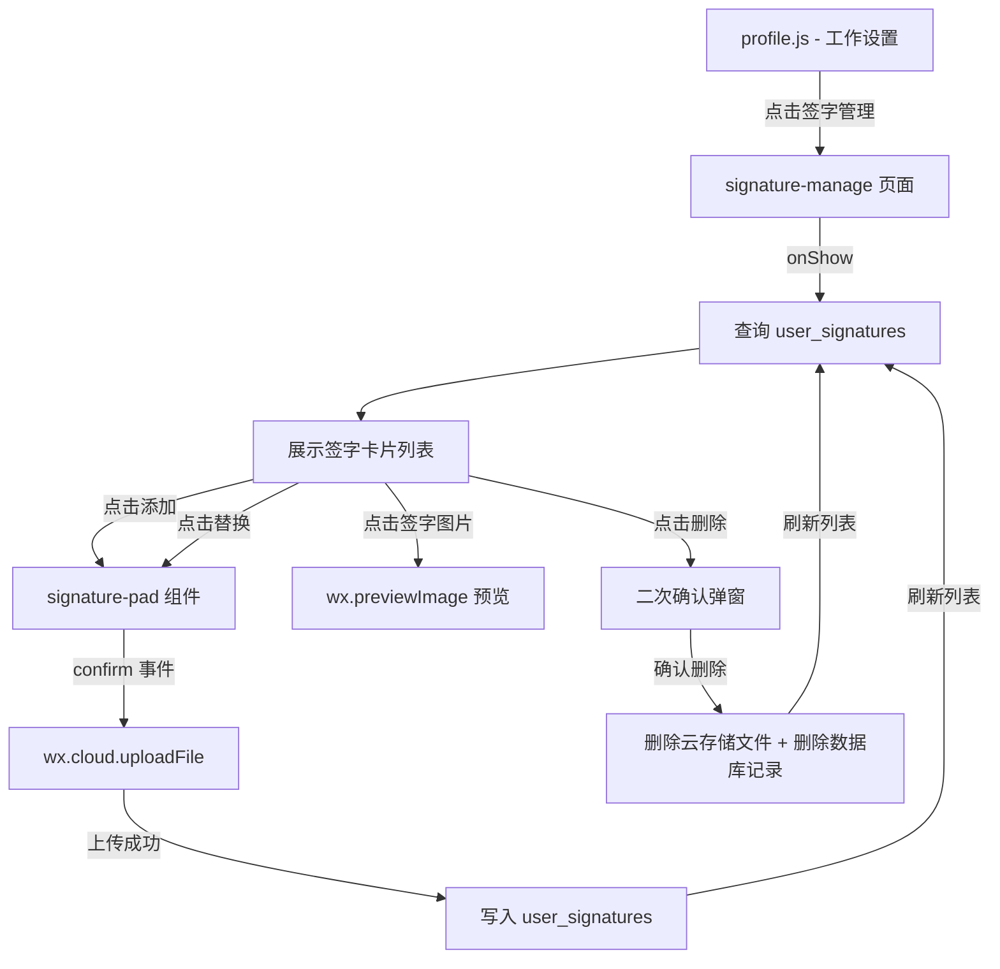

## Product Overview

在个人中心的"工作设置"菜单组中新增"签字管理"功能。用户可在独立页面中查看、创建、替换和删除自己的手写签字（最多保存2个），签字使用已有的 signature-pad 组件进行手写输入。

## Core Features

- 在 profile.js 的 menuGroups "工作设置" 中新增"签字管理"菜单项，点击跳转到签字管理页面
- 新建签字管理页面，展示用户已保存的签字（最多2个），支持以下操作：
- 点击"添加签字"打开 signature-pad 组件进行手写签名
- 签名确认后上传图片到云存储，并在数据库中创建签字记录
- 点击已有签字可预览大图
- 支持替换已有签字（重新签名覆盖）
- 支持删除已有签字（需二次确认）
- 已达上限（2个）时隐藏或禁用"添加"按钮
- 新建数据库集合 `user_signatures` 存储签字记录
- 在 app.json 中注册新页面路由
- 更新 DATABASE_COLLECTIONS_REFERENCE.md 文档

## Tech Stack

- 微信小程序原生开发（WXML + WXSS + JS）
- CloudBase NoSQL 文档数据库（`user_signatures` 集合）
- CloudBase 云存储（签字图片存储）
- 已有组件：`signature-pad`（手写签名组件）

## Implementation Approach

### 数据存储策略

- **数据库**：新建 `user_signatures` 集合，安全规则 `PRIVATE`（仅创建者可读写）。`PRIVATE` 规则检查 `_openid` 字段，由小程序端直接创建记录时自动填充，适合用户自行管理的个人数据场景。
- **云存储**：签字图片上传路径 `signatures/{openid}/{timestamp}_{index}.png`，fileID 存入数据库记录。读取时通过 `wx.cloud.getTempFileURL` 获取临时链接用于显示。
- **限制2个**：前端查询时检查已有数量，达到2个时隐藏添加按钮；同时在数据库操作时也做 count 校验作为安全兜底。

### 关键技术决策

1. **前端直连数据库 vs 云函数**：签字是用户个人数据（PRIVATE 规则），且操作简单（CRUD），采用前端直连数据库方式，无需新建云函数，减少复杂度。图片上传使用 `wx.cloud.uploadFile` 前端直传。
2. **不使用分页**：每人最多2条记录，一次查询即可全部获取，无需 paginationBehavior。
3. **图片存储方案**：signature-pad 导出的是本地临时文件路径（tempFilePath），需上传到云存储获取 fileID 持久化存储，显示时再获取临时下载链接。

## Implementation Notes

### 数据库集合设计

```javascript
// user_signatures 集合
{
  _id: String,           // 记录 ID（自动生成）
  _openid: String,       // 创建者 openid（PRIVATE 规则自动填充）
  fileID: String,        // 云存储文件 ID
  label: String,         // 签字标签（如 '签字 1'、'签字 2'）
  index: Number,         // 排序序号（0 或 1）
  createdAt: Number,     // 创建时间戳
  updatedAt: Number      // 更新时间戳
}
```

- 索引：`idx_openid`（openid 升序），优化按用户查询
- 安全规则：`PRIVATE`
- cloudPath 格式：`signatures/{openid}/{timestamp}_{index}.png`

### 文件上传模式（参考 repair.js）

```javascript
wx.cloud.uploadFile({
  cloudPath: `signatures/${openid}/${Date.now()}_${index}.png`,
  filePath: tempFilePath  // signature-pad confirm 事件返回的 tempFilePath
})
```

### 爆炸半径控制

- 仅修改 profile.js 中的 menuGroups 和 handleMenuTap（各加1条）
- 仅在 app.json pages 数组中追加1条路由
- 新建4个文件（签字管理页面），不影响任何现有功能
- 新建数据库集合，不影响现有集合

## Architecture Design



## Directory Structure

```
project-root/
├── miniprogram/
│   ├── app.json                              # [MODIFY] 追加签字管理页面路由
│   ├── pages/office/profile/
│   │   └── profile.js                        # [MODIFY] menuGroups 添加签字管理项 + handleMenuTap 路由
│   └── pages/office/signature-manage/
│       ├── signature-manage.js               # [NEW] 签字管理页面逻辑：加载签字、打开签名板、上传、删除
│       ├── signature-manage.json             # [NEW] 页面配置：导航栏标题 + 注册 signature-pad 组件
│       ├── signature-manage.wxml             # [NEW] 页面模板：渐变头部 + 签字卡片列表 + 添加按钮 + signature-pad
│       └── signature-manage.wxss             # [NEW] 页面样式：复用 office-page 布局 + 签字卡片样式
├── .codebuddy/docs/
│   └── DATABASE_COLLECTIONS_REFERENCE.md     # [MODIFY] 追加 user_signatures 集合定义
```

## Design Style

采用项目统一的办公风格设计，复用 `office-page`、`office-gradient-header`、`office-content`、`office-card` 等全局样式类。

## Page Design: signature-manage（签字管理）

### Block 1: Gradient Header（渐变头部）

- 复用 `office-gradient-header` 样式
- 标题："签字管理"，副标题："管理您的手写签字，最多保存2个"
- 背景色与 profile 页面一致（蓝紫渐变）

### Block 2: Signature Cards（签字卡片区域）

- `office-content` 包裹
- 每个签字以 `office-card` 卡片展示，包含：
- 左侧：签字缩略图（白色背景，圆角，居中显示签字图片，aspect-ratio 5:4）
- 右侧信息区：
    - 签字标签（"签字 1"、"签字 2"）
    - 创建时间
    - 操作按钮行：预览、替换、删除（红色文字）
- 无签字时显示空状态提示：签名图标 + "暂无签字，请添加"

### Block 3: Add Button（添加按钮）

- 固定在底部或卡片列表下方
- 主色调按钮："添加签字"
- 已达2个上限时禁用（灰色 + 文字提示"已达到上限"）

### Block 4: Signature Pad（签字板组件）

- 使用已有 `signature-pad` 组件，全屏遮罩弹窗
- 通过 `show` 属性控制显隐
- 监听 `confirm` 事件获取 tempFilePath，监听 `cancel` 事件关闭

### Block 5: Delete Confirm Dialog（删除确认弹窗）

- 使用 wx.showModal 原生弹窗进行二次确认
- 确认后先删除云存储文件，再删除数据库记录

## Agent Extensions

### MCP

- **CloudBase MCP - writeSecurityRule**
- Purpose: 为新建的 `user_signatures` 集合配置 PRIVATE 安全规则
- Expected outcome: 集合安全规则设置为 PRIVATE，确保仅创建者可读写
- **CloudBase MCP - writeNoSqlDatabaseStructure**
- Purpose: 在 user_signatures 集合上创建 openid 索引
- Expected outcome: 创建 idx_openid 索引，优化按用户查询性能