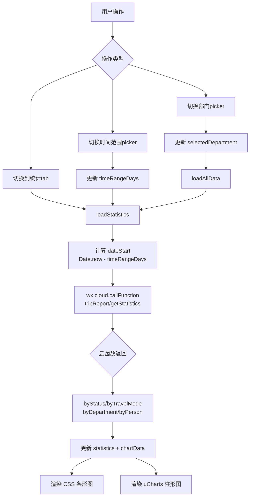

## Product Overview

"出行管理"Dashboard 页面的三项增强：部门负责人权限限制、统计时长选择器、uCharts 个人出行柱形图可视化。

## Core Features

- 部门负责人角色登录出行管理页时，部门 picker 仅显示自己所在部门，无"全部"选项，无法切换到其他部门；馆领导和管理员保持原有行为不变
- 部门 picker 右侧新增"统计时长"picker，选项为【过去一个月】【过去三个月】【过去半年】，默认选中"过去一个月"，选择后重新加载统计数据
- 统计时长影响统计 tab 页的全部数据（状态统计、出行方式、部门统计、个人柱形图），以及概览 tab 的"本月出行次数"卡片
- 引入 uCharts 组件，在统计 tab 页新增"个人出行排行"区域，以柱形图展示每个人在所选时段内的出行次数

## Tech Stack

- 微信小程序原生开发（WXML + JS + WXSS）
- uCharts（微信小程序版，通过 npm 安装 `@qiun/unie-charts`，使用 Canvas 2D 渲染）

## Implementation Approach

### 1. 部门负责人权限限制

修改 `trip-dashboard.js` 的 `loadConstants()` 方法（第134-146行），当 `this.data.userRole === '部门负责人'` 时，`departmentOptions` 仅设为 `[this.data.currentUser.department]`。WXML 中当 `departmentOptions.length <= 1` 时隐藏下拉箭头。无需修改云函数。

### 2. 统计时长选择器

- **WXML**：在部门筛选区域内，部门 picker 右侧新增一个时间范围 picker，选项为 `['过去一个月', '过去三个月', '过去半年']`
- **JS data**：新增 `timeRangeOptions: ['过去一个月', '过去三个月', '过去半年']`、`selectedTimeRange: '过去一个月'`（默认值）、`timeRangeDays: 30`（对应天数）
- **JS 逻辑**：新增 `handleTimeRangeChange()` 方法，根据选项计算 `dateStart` 时间戳（30/90/180天前），然后调用 `loadStatistics()` 重新加载统计数据
- **影响范围**：`loadStatistics()` 方法（第214-266行）当前硬编码为本月数据，改为使用 `timeRangeDays` 计算动态 `dateStart`；概览 tab 的统计卡片也改为使用相同的时间范围
- `loadAllData()` 中并行的 `loadStatistics()` 会自动使用新的时间范围

### 3. uCharts 个人出行柱形图

- **安装**：在 miniprogram 目录执行 `npm install @qiun/unie-charts`，然后手动复制到 `miniprogram_npm/`（与之前 mp-html 相同方式，因为该项目 npm 构建不自动收录）
- **云函数修改**：`tripReport/index.js` 的 `getStatistics()` 函数（第377-440行）新增 `byPerson` 统计维度，按 `userName` 聚合出行次数，返回按次数降序排列的数组 `[{name, count}]`
- **前端 JS**：`loadStatistics()` 接收 `byPerson` 数据后，构建 uCharts 的 `chartData.person` 配置对象（categories + series）
- **前端 WXML**：在统计 tab 末尾新增 uCharts canvas 容器，使用 `<canvas type="2d" id="personChart">`
- **前端 JSON**：注册 uCharts 组件
- **初始化时机**：在 `loadStatistics` 成功回调中调用 `this.initPersonChart()` 方法，通过 `wx.createSelectorQuery()` 获取 canvas 实例并渲染柱形图

### uCharts 数据格式

```js
chartData: {
  person: {
    categories: ['张三', '李四', '王五'],  // 按 count 降序
    series: [{ name: '出行次数', data: [12, 8, 5] }]
  }
}
```

## Implementation Notes

- 部门限制仅前端改动，后端已有 department 参数过滤
- 统计时长选择器的 dateStart 计算使用 `Date.now() - days * 24*60*60*1000`，不设 dateEnd（取到当前时间）
- uCharts 安装后若 npm 构建不收录，需手动复制 dist 目录到 miniprogram_npm（与 mp-html 相同处理方式）
- uCharts 柱形图配置：圆角柱形、渐变色填充、Y 轴整数刻度、X 轴人名支持滚动（人数多时）
- 云函数 byPerson 统计按出行次数降序取前20人，避免数据量过大

## Architecture Design



## Directory Structure

```
miniprogram/
├── miniprogram_npm/
│   └── qiun-unie-charts/    # [NEW] 手动复制的 uCharts 组件
├── pages/office/trip-dashboard/
│   ├── trip-dashboard.json  # [MODIFY] 注册 uCharts 组件
│   ├── trip-dashboard.js    # [MODIFY] 部门限制 + 时间范围 + uCharts 初始化
│   ├── trip-dashboard.wxml  # [MODIFY] 新增时间范围 picker + uCharts canvas
│   └── trip-dashboard.wxss  # [MODIFY] 筛选器布局调整 + 图表容器样式
cloudfunctions/
└── tripReport/
    └── index.js             # [MODIFY] getStatistics 新增 byPerson 统计
```