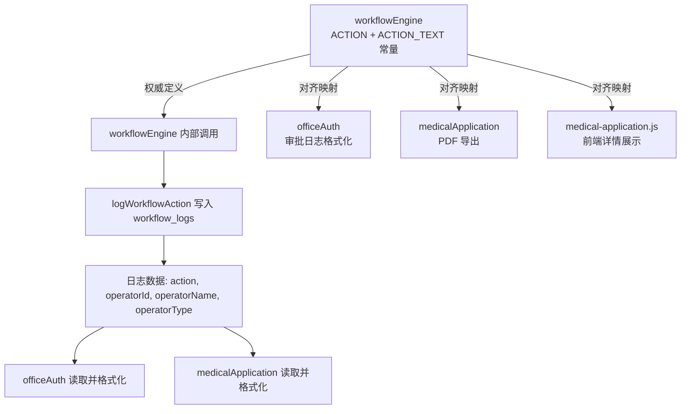

## Product Overview

修复工作流日志（workflow_logs）中 action 字段定义不统一、actionText 映射不一致、以及日志写入时 operatorName/operatorType 错误的问题。

## Core Features

- 在 workflowEngine 中新增 ACTION 和 ACTION_TEXT 常量定义，作为全项目的唯一权威来源
- 修复 startWorkflow 写日志时 operatorName 写死为"申请人"的 bug，改为使用 businessData.applicantName
- 修复 completeWorkflow 写日志时 operatorId/operatorName 使用最后审批人的 bug，改为使用 'system'/'系统'
- 统一所有 actionText 映射：workflowEngine（日志描述）、officeAuth（审批中心日志展示）、medicalApplication 云函数（PDF导出）、medical-application.js 前端（详情弹窗）
- 医疗申请前端的 actionText 中 'submit' 改为 'start'，并补充 'complete'、'cancel'、'terminate'、'supplement' 的映射
- officeAuth 的 actionText 中补充 'complete' 和 'supplement' 的映射
- 统一措辞：reject 统一为"审批驳回"，return 统一为"退回补充"

## Tech Stack

- 微信小程序 + CloudBase 云函数（Node.js）
- 现有架构：多云函数协作（workflowEngine 核心引擎 + officeAuth 审批中心 + medicalApplication 就医申请）

## Implementation Approach

### 策略

以 workflowEngine 中的常量定义为 Single Source of Truth，其他所有消费者（云函数、前端）对齐该定义。由于小程序前端无法直接 require 云函数代码，采用"同构映射"方式：在 workflowEngine 定义 ACTION/ACTION_TEXT，其他各处复制相同的映射对象，通过代码注释标注来源。

### 关键决策

1. **不新建 shared npm 包**：项目规模不需要，且云函数和前端的模块系统不同，通过代码约定 + 注释保证一致性即可
2. **completeWorkflow 的 operator 改为 'system'**：流程完成是系统自动行为，不是用户主动操作，operatorId='system'、operatorName='系统'
3. **措辞统一**：reject → "审批驳回"，return → "退回补充"（与 officeAuth 最完整的映射保持一致）
4. **'submit' 不再使用**：workflowEngine 写入的一直是 'start'，就医申请前端和PDF导出中误用的 'submit' 修正为 'start'

### 性能与可靠性

- 仅涉及常量替换和条件修改，无性能影响
- 修改范围精确控制，不影响日志写入逻辑和主流程
- 修复后的日志数据对新旧记录都兼容（新映射覆盖所有已有 action 值）

## Implementation Notes

- workflowEngine 的 `approveTask` 中 actionText 用于 description 拼接（"审批操作: 通过/驳回/退回"），改为使用 ACTION_TEXT 常量保持一致性
- startWorkflow 的 operatorName 修复：`businessData.applicantName` 可能不存在（兜底 '申请人'）
- completeWorkflow 的修复：approverId/approverName 是 handleApproval 传来的最后审批人，日志中应改为 'system'
- 部署时需要重新部署 workflowEngine、officeAuth、medicalApplication 三个云函数

## Architecture Design



## Directory Structure

```
project-root/
├── cloudfunctions/
│   ├── workflowEngine/
│   │   └── index.js              # [MODIFY] 新增 ACTION/ACTION_TEXT 常量；修复 startWorkflow operatorName；修复 completeWorkflow operator 为 system；approveTask actionText 使用常量
│   ├── officeAuth/
│   │   └── index.js              # [MODIFY] 对齐 actionText 映射：补充 complete/supplement；统一措辞
│   └── medicalApplication/
│       └── index.js              # [MODIFY] 对齐 PDF 导出 actionText：'submit'→'start'，补充 complete/cancel/terminate/supplement；统一措辞
├── miniprogram/
│   └── pages/office/medical-application/
│       └── medical-application.js # [MODIFY] 对齐前端 actionText：'submit'→'start'，补充 complete/cancel/terminate/supplement；统一措辞
```

## Key Code Structures

### workflowEngine/index.js 新增常量（放在现有 TIMEOUT_ACTION 之后）

```javascript
// 工作流操作类型常量（Single Source of Truth）
const ACTION = {
  START: 'start',
  APPROVE: 'approve',
  REJECT: 'reject',
  RETURN: 'return',
  COMPLETE: 'complete',
  CANCEL: 'cancel',
  TERMINATE: 'terminate',
  SUPPLEMENT: 'supplement'
}

// 操作类型中文映射（全项目统一使用此映射）
const ACTION_TEXT = {
  [ACTION.START]: '提交工单',
  [ACTION.APPROVE]: '审批通过',
  [ACTION.REJECT]: '审批驳回',
  [ACTION.RETURN]: '退回补充',
  [ACTION.COMPLETE]: '流程完成',
  [ACTION.CANCEL]: '撤回工单',
  [ACTION.TERMINATE]: '中止工单',
  [ACTION.SUPPLEMENT]: '补充资料'
}
```

### 统一的 actionText 映射模板（各消费者复制此对象，注释标注来源）

```javascript
// 操作类型中文映射（与 workflowEngine ACTION_TEXT 保持一致）
const ACTION_TEXT = {
  'start': '提交工单',
  'approve': '审批通过',
  'reject': '审批驳回',
  'return': '退回补充',
  'complete': '流程完成',
  'cancel': '撤回工单',
  'terminate': '中止工单',
  'supplement': '补充资料'
}
```

## Agent Extensions

### SubAgent

- **code-explorer**
- Purpose: 用于验证修改后的代码是否正确对齐了所有 action 值和 actionText 映射
- Expected outcome: 确认所有 4 个文件中的 actionText 映射完全一致，且与 workflowEngine 的 ACTION_TEXT 常量匹配