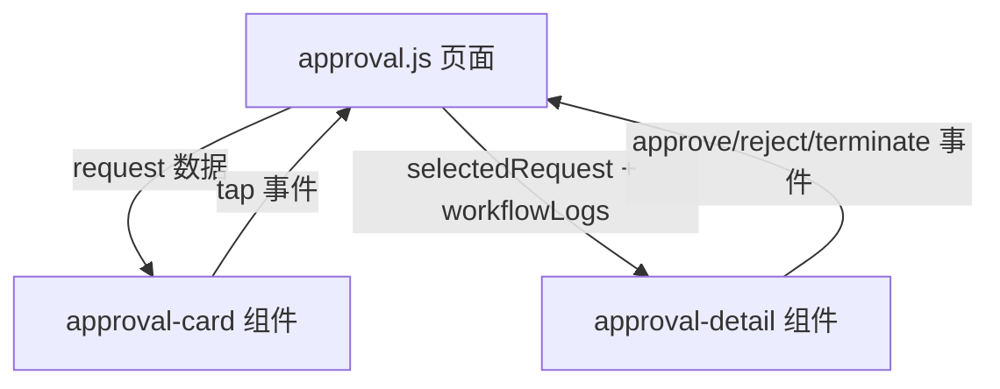

## 用户需求

将审批中心的申请卡片抽象为可复用组件，支持：

1. **根据申请类型显示名称、标题** - 支持就医申请、注册申请、信息修改申请等多种类型
2. **根据申请内容显示各字段** - 不同类型显示不同的详情字段
3. **根据流程显示进度条** - 多步骤工作流显示进度条，单步审批不显示
4. **根据处理日志显示历史** - 显示审批历史记录

## 核心功能

- **approval-card** 列表卡片组件：用于审批列表中的条目展示
- **approval-detail** 详情弹窗组件：用于展示申请详情和操作按钮

## 组件设计原则

- 单一职责：每个组件只负责一种展示形态
- 配置驱动：通过 props 控制显示内容和行为
- 样式继承：复用现有样式，保持视觉一致性

## 技术栈

- 微信小程序原生组件开发
- 使用 Component() 构造器定义组件
- 样式文件独立（wxss）
- 模板文件独立（wxml）

## 组件架构设计

### 组件拆分方案

```
components/
├── approval-card/           # 列表卡片组件
│   ├── approval-card.js
│   ├── approval-card.json
│   ├── approval-card.wxml
│   └── approval-card.wxss
└── approval-detail/         # 详情弹窗组件
    ├── approval-detail.js
    ├── approval-detail.json
    ├── approval-detail.wxml
    └── approval-detail.wxss
```

### 数据流设计



### 组件 Props 设计

**approval-card 组件：**

| 属性 | 类型 | 说明 |
| --- | --- | --- |
| request | Object | 申请数据对象（映射后的） |
| showActions | Boolean | 是否显示操作按钮 |
| actionLoading | Boolean | 操作加载状态 |


**approval-detail 组件：**

| 属性 | 类型 | 说明 |
| --- | --- | --- |
| visible | Boolean | 是否显示弹窗 |
| request | Object | 申请详情数据 |
| workflowLogs | Array | 工作流日志 |
| canReview | Boolean | 当前用户是否有审批权 |
| currentOpenid | String | 当前用户 openid |
| actionLoading | Boolean | 操作加载状态 |


## 实现细节

### 字段配置化

将不同类型申请的字段配置抽取为配置对象，组件根据 orderType 读取配置动态渲染：

```javascript
const FIELD_CONFIGS = {
  medical_application: [
    { key: 'patientName', label: '就医人姓名' },
    { key: 'relation', label: '与申请人关系' },
    { key: 'medicalDate', label: '就医时间' },
    { key: 'institution', label: '就医机构' },
    { key: 'reason', label: '就医原因' }
  ],
  user_registration: [
    { key: 'name', label: '姓名' },
    { key: 'gender', label: '性别' },
    { key: 'birthday', label: '出生日期' },
    { key: 'role', label: '角色' },
    { key: 'department', label: '部门' },
    { key: 'position', label: '岗位' }
  ],
  user_profile_update: [
    { key: 'name', label: '姓名' },
    { key: 'role', label: '角色' },
    { key: 'department', label: '部门' },
    { key: 'position', label: '岗位' },
    { key: 'updateReason', label: '修改原因' }
  ]
}
```

### 进度条逻辑

组件内部根据 `orderType` 和 `showProgress` 判断是否显示进度条，进度数据由父组件传入。

### 样式隔离

使用 `styleIsolation: 'apply-shared'` 让组件继承页面样式，同时定义组件私有样式。

## 目录结构

```
miniprogram/
├── components/
│   ├── pagination-loading/   # 现有组件
│   ├── approval-card/        # [NEW] 列表卡片组件
│   │   ├── approval-card.js
│   │   ├── approval-card.json
│   │   ├── approval-card.wxml
│   │   └── approval-card.wxss
│   └── approval-detail/      # [NEW] 详情弹窗组件
│       ├── approval-detail.js
│       ├── approval-detail.json
│       ├── approval-detail.wxml
│       └── approval-detail.wxss
├── pages/office/approval/
│   ├── approval.js           # [MODIFY] 引用组件，简化代码
│   ├── approval.json         # [MODIFY] 注册组件
│   ├── approval.wxml         # [MODIFY] 使用组件替换原有代码
│   └── approval.wxss         # [MODIFY] 移除已抽取的样式
```