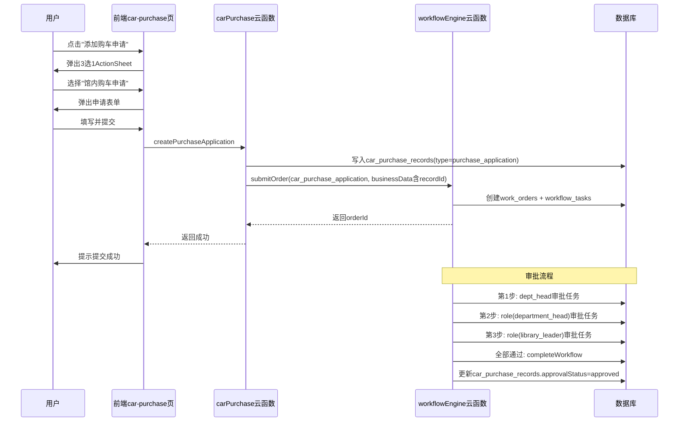

## 产品概述

在购车管理页添加"馆内购车申请"功能，用户点击"添加购车申请"后先选择申请类型，馆内购车申请走工作流审批流程。

## 核心功能

- 点击"添加购车申请"弹出3选1选择弹窗：馆内购车申请、馆内购车借款申请（预留）、开始购车流程（现有行为）
- 馆内购车申请表单：姓名/部门自动填充不可编辑，到馆日期picker，任期月数加减调整（默认48），职别，对应购车标准（美元），对应购车最低限额标准（美元）
- 拟购车辆简况分组：拟购车日期picker，售车公司，品牌，规格型号，排气量，是否新车Switch（默认是，选否则显示已行驶时间和已行驶里程，选是则二者默认"无"不可编辑），售价含运费（placeholder:雷亚尔），折美元，是否申请购车借款Switch
- 审批流程：同部门负责人→办公室部门负责人→馆领导，审批通过后条目出现在"我的购车记录"
- 数据存入car_purchase_records集合，通过type字段区分（purchase_application/purchase_loan/purchase_process）

## 技术栈

- 前端：微信小程序原生框架（WXML/WXSS/JS）
- 云函数：wx-server-sdk（Node.js）
- 工作流引擎：现有workflowEngine云函数
- 数据库：云开发NoSQL（car_purchase_records / workflow_templates / work_orders / workflow_tasks / workflow_logs）

## 实现方案

### 整体策略

馆内购车申请是一个全新的业务类型，与现有"购车流程"（Checklist模式）完全不同。它走通用工作流引擎，前端需要新的表单弹窗，后端需要新的创建逻辑和审批回调处理。数据存储复用car_purchase_records集合，通过type字段区分，保证"我的购车记录"可统一展示三种类型的条目。

### 关键技术决策

**1. type字段设计**

- `purchase_application`：馆内购车申请（本次实现）
- `purchase_loan`：馆内购车借款申请（预留）
- `purchase_process`：购车流程（现有，需要给已有记录补此值或查询时默认处理）

**2. 工作流模板code**

- 使用 `car_purchase_application` 作为工作流模板code
- 3步审批：dept_head → role(department_head, 办公室部门负责人) → role(library_leader, 馆领导)
- 第2步"办公室部门负责人"需使用role类型+approverConfig.roleIds=['department_head']配合条件筛选办公室部门，但由于现有resolveApprovers按role查所有部门负责人，这里需要用dept_head类型但限定department='办公室'。实际方案：第2步用role类型roleIds=['department_head']，云引擎会创建共享任务，办公室部门负责人在approverList中，任何人可审批。这与护照借用审批第1步类似但需确保只由办公室部门负责人审批。

**3. 前端交互流程**

- 点击"添加购车申请" → wx.showActionSheet展示3个选项 → 选择"馆内购车申请" → 弹出申请表单弹窗 → 填写提交 → 调用carPurchase云函数createPurchaseApplication → 云函数创建car_purchase_records记录并调用workflowEngine启动工作流

**4. 审批通过后的处理**

- workflowEngine.completeWorkflow增加car_purchase_application的特殊处理：更新car_purchase_records中对应记录的approvalStatus为'approved'，并推送通知给申请人

**5. 审批中心集成**

- 工作流模板配置displayConfig（cardFields + detailFields），审批中心自动通过mapOrderToDisplayItem展平businessData渲染
- approval.js中approvalTypeIcons添加car_purchase_application的图标配置

**6. "我的购车记录"展示**

- 现有getMyList查询无需修改（查询applicantOpenid=当前用户的所有记录），但列表卡片需要根据type显示不同信息
- purchase_application类型显示：申请人+职别+品牌+审批状态
- purchase_process类型（现有）：车型+进度

### 性能与可靠性

- 工作流启动使用cloud.callFunction跨云函数调用，需注意超时（设置timeout合理值）
- car_purchase_records查询添加type字段后，现有查询需兼容无type字段的旧记录（默认视为purchase_process）
- 审批回调中更新car_purchase_records需要记录recordId，通过work_orders.businessData.recordId关联

## 架构设计



## 目录结构

```
d:\WechatPrograms\ceshi\
├── cloudfunctions/
│   ├── carPurchase/
│   │   └── index.js                    # [MODIFY] 新增createPurchaseApplication action，createRecord加type字段，getMyList/getAllList适配type展示
│   ├── workflowEngine/
│   │   └── index.js                    # [MODIFY] completeWorkflow新增car_purchase_application特殊处理
│   └── initWorkflowDB/
│       └── index.js                    # [MODIFY] 新增car_purchase_application工作流模板定义
├── miniprogram/
│   ├── pages/office/car-purchase/
│   │   ├── car-purchase.js             # [MODIFY] 新增类型选择弹窗、馆内购车申请表单逻辑、提交逻辑、列表卡片type区分
│   │   ├── car-purchase.wxml           # [MODIFY] 新增类型选择弹窗、馆内购车申请表单弹窗、列表卡片type条件渲染
│   │   └── car-purchase.wxss           # [MODIFY] 新增申请表单样式、分组标题样式、Switch样式
│   └── pages/office/approval/
│       └── approval.js                 # [MODIFY] approvalTypeIcons添加car_purchase_application图标配置
```

## 实现要点

### 1. carPurchase云函数新增action

- `createPurchaseApplication`：接收表单数据，自动获取用户姓名部门，写入car_purchase_records（type='purchase_application', approvalStatus='pending'），然后调用workflowEngine启动工作流，businessData中携带recordId和所有表单字段
- `createRecord`（现有）：添加type='purchase_process'字段
- `getMyList/getAllList`：返回数据增加type和approvalStatus字段，前端根据type展示不同信息

### 2. 工作流模板定义（initWorkflowDB）

```javascript
{
  name: '馆内购车申请审批',
  code: 'car_purchase_application',
  version: 1,
  steps: [
    { stepNo: 1, stepName: '同部门负责人审批', approverType: 'dept_head' },
    { stepNo: 2, stepName: '办公室部门负责人审批', approverType: 'dept_head', approverConfig: { department: '办公室' } },
    { stepNo: 3, stepName: '馆领导审批', approverType: 'role', approverConfig: { roleIds: ['library_leader'] } }
  ],
  displayConfig: {
    cardFields: [
      { field: 'applicantName', label: '申请人' },
      { field: 'position', label: '职别' },
      { field: 'brand', label: '品牌' }
    ],
    detailFields: [
      { field: 'applicantName', label: '姓名' },
      { field: 'department', label: '部门' },
      { field: 'arrivalDate', label: '到馆日期' },
      { field: 'tenureMonths', label: '任期月数' },
      { field: 'position', label: '职别' },
      { field: 'purchaseStandard', label: '对应购车标准(美元)' },
      { field: 'minPurchaseStandard', label: '对应购车最低限额标准(美元)' },
      { field: 'intendedPurchaseDate', label: '拟购车日期' },
      { field: 'dealerCompany', label: '售车公司' },
      { field: 'brand', label: '品牌' },
      { field: 'specification', label: '规格型号' },
      { field: 'displacement', label: '排气量' },
      { field: 'isNewCar', label: '是否新车', type: 'boolean' },
      { field: 'usedDuration', label: '已行驶时间', condition: { field: 'isNewCar', op: '==', value: false } },
      { field: 'usedMileage', label: '已行驶里程', condition: { field: 'isNewCar', op: '==', value: false } },
      { field: 'priceInReal', label: '售价含运费(雷亚尔)' },
      { field: 'priceInUSD', label: '折美元' },
      { field: 'applyCarLoan', label: '是否申请购车借款', type: 'boolean' }
    ]
  }
}
```

**注意**：第2步"办公室部门负责人"使用dept_head类型需要额外处理，因为现有resolveApprovers的dept_head逻辑是找"申请人同部门"的负责人。需要扩展：当approverConfig指定了department时，按指定部门查找负责人。这是对工作流引擎的小幅扩展。

### 3. workflowEngine completeWorkflow扩展

新增car_purchase_application分支：审批通过后，通过businessData.recordId找到car_purchase_records记录，更新approvalStatus='approved'，推送通知给申请人。

### 4. 前端表单交互

- 是否新车Switch：默认true，切换时动态控制已行驶时间/已行驶里程的显隐和禁用状态
- 任期月数：加减按钮组件，步长1，默认48
- 表单验证：必填字段校验（到馆日期、职别、购车标准、最低限额、拟购车日期、品牌、售价）

### 5. 旧数据兼容

现有car_purchase_records无type字段，查询时需兼容：

- 云函数getMyList返回时，无type字段的记录补type='purchase_process'
- 前端列表卡片根据type条件渲染不同内容

## 设计风格

延续现有购车管理页的青蓝色主题（#0891B2），新增的馆内购车申请表单采用分组卡片式布局，与现有弹窗风格保持一致。

## 页面设计

### 类型选择弹窗

底部弹出ActionSheet样式，3个选项纵向排列，每项左侧带图标+标题+简要说明，选中项高亮。"馆内购车借款申请"选项灰显并标注"即将开放"。

### 馆内购车申请表单弹窗

全屏底部弹出（高度85vh），顶部标题栏+关闭按钮，内容区可滚动，底部提交按钮固定。

表单分为两个视觉分组：

- **基本信息区**：姓名/部门灰色只读展示，到馆日期picker，任期月数加减器，职别输入，两个美元标准输入
- **拟购车辆简况区**：分组标题栏（带图标），拟购车日期picker，文本输入系列，是否新车Switch及条件字段，价格输入，借款申请Switch

Switch控件使用现有青蓝色主题色，ON状态#0891B2，OFF状态#CBD5E1。

### 列表卡片type区分

- purchase_application：显示姓名+职别+品牌+审批状态标签（待审批/已通过/已驳回）
- purchase_process：保持现有车型+进度条展示