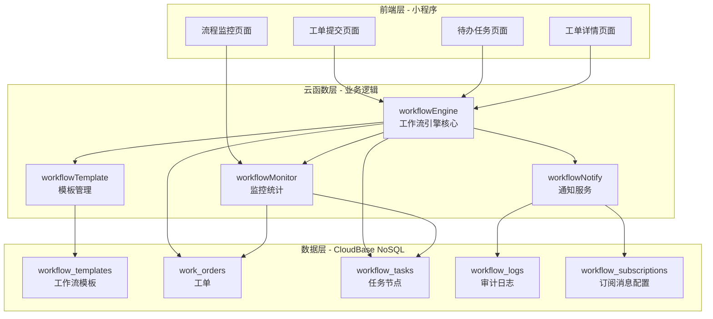

# 工作流基础框架 - 技术方案设计

## 技术架构

### 整体架构



### 技术栈选择

- **前端**: 微信小程序原生开发 + TDesign组件库
- **后端**: CloudBase云函数(Node.js 18.15)
- **数据库**: CloudBase NoSQL文档数据库
- **通知**: 微信订阅消息 + 小程序内消息
- **存储**: CloudBase云存储(用于附件上传)

## 数据库设计

### 集合1: workflow_templates (工作流模板)

```javascript
{
  _id: String,                    // 模板ID
  name: String,                   // 模板名称
  code: String,                   // 模板代码(唯一标识)
  version: Number,                // 版本号
  description: String,             // 描述
  category: String,               // 分类(如: approval, request, process)
  
  // 步骤配置
  steps: [{
    stepNo: Number,               // 步骤序号
    stepName: String,             // 步骤名称
    stepType: String,            // 步骤类型: serial(串行)/parallel(并行)/condition(条件分支)
    approverType: String,        // 审批人类型: user(具体用户)/role(角色)/dept(部门)/expression(动态表达式)
    approverConfig: {           // 审批人配置
      userIds: [String],        // 用户openid列表(适用type=user)
      roleIds: [String],        // 角色ID列表(适用type=role)
      deptId: String,          // 部门ID(适用type=dept)
      expression: String         // 动态表达式(适用type=expression)
    },
    
    // 审批策略
    approvalStrategy: String,     // 审批策略: consensus(会签)/anyone(或签)/sequential(顺序签)
    autoPass: Boolean,          // 是否自动通过
    timeout: Number,            // 超时时间(小时)
    timeoutAction: String,      // 超时处理: auto_approve(自动通过)/auto_reject(自动驳回)/escalate(升级)/remind(仅提醒)
    canReject: Boolean,         // 是否可驳回
    canReturn: Boolean,         // 是否可退回
    returnTo: Number,          // 退回到指定步骤(0=申请人)
    
    // 条件分支
    condition: {                // 执行条件(可选)
      field: String,          // 业务数据字段
      operator: String,        // 运算符: gt/lt/eq/neq/gte/lte/in/contains
      value: Any              // 比较值
    },
    
    // 并行配置
    parallelConfig: {          // 并行审批配置(可选)
      parallelType: String,    // 并行类型: and(会签)/or(或签)
      minApprovals: Number    // 最少通过人数
    }
  }],
  
  // 流程配置
  defaultTimeout: Number,         // 默认超时时间
  notifyOnSubmit: Boolean,        // 提交时是否通知
  notifyOnComplete: Boolean,      // 完成时是否通知
  notifyOnTimeout: Boolean,       // 超时时是否通知
  
  status: String,               // 状态: active(激活)/inactive(未激活)/archived(已归档)
  createdBy: String,           // 创建人openid
  createdAt: Number,            // 创建时间戳
  updatedAt: Number            // 更新时间戳
}
```

### 集合2: work_orders (工单)

```javascript
{
  _id: String,                    // 工单ID
  orderNo: String,               // 工单编号(自动生成)
  orderType: String,             // 工单类型(对应模板code)
  templateId: String,            // 关联的模板ID
  templateVersion: Number,        // 使用的模板版本
  
  // 业务数据
  businessData: {                // 业务数据(动态结构)
    applicantId: String,         // 申请人openid
    applicantName: String,       // 申请人姓名
    // ...其他业务字段,根据具体业务类型而定
  },
  
  // 流程状态
  workflowStatus: String,        // 流程状态: pending(审批中)/supplement(待补充)/completed(已完成)/rejected(已驳回)/cancelled(已取消)
  currentStep: Number,          // 当前步骤序号
  
  // 流程配置快照
  workflowSnapshot: {           // 模板配置快照(审批时快照,后续模板修改不影响)
    templateId: String,
    version: Number,
    steps: [                   // 实际执行的步骤序列(已过滤条件)
      // ...同workflow_templates.steps结构
    ]
  },
  
  // 流程执行信息
  submittedAt: Number,          // 提交时间
  startedAt: Number,            // 开始执行时间
  completedAt: Number,          // 完成时间
  finalDecision: String,        // 最终决策: approved(通过)/rejected(驳回)
  
  // 补充资料
  supplementCount: Number,       // 补充次数
  needSupplement: Boolean,      // 是否需要补充
  supplementReason: String,      // 补充原因
  
  // 统计信息
  totalDuration: Number,        // 总耗时(毫秒)
  stepCount: Number,           // 实际步骤数
  
  createdAt: Number,            // 创建时间
  updatedAt: Number            // 更新时间
}
```

### 集合3: workflow_tasks (任务节点)

```javascript
{
  _id: String,                    // 任务ID
  orderId: String,               // 关联工单ID
  stepNo: Number,               // 步骤序号
  stepName: String,             // 步骤名称
  stepType: String,            // 步骤类型: serial/parallel
  
  // 审批人
  approverType: String,        // 审批人类型
  approverId: String,         // 审批人ID(用户openid或角色ID)
  approverName: String,       // 审批人姓名
  agentId: String,           // 代理人openid(可选)
  
  // 任务状态
  taskStatus: String,         // 任务状态: pending(待处理)/approved(已通过)/rejected(已驳回)/cancelled(已取消)/returned(已退回)
  action: String,            // 操作: approve/reject/return/timeout
  
  // 审批内容
  comment: String,            // 审批意见
  attachments: [{            // 附件列表
    fileId: String,         // 文件ID
    fileName: String,       // 文件名
    fileSize: Number,       // 文件大小
    fileUrl: String        // 文件URL
  }],
  
  // 时间记录
  createdAt: Number,         // 任务创建时间
  assignedAt: Number,       // 分配时间
  startedAt: Number,        // 开始处理时间
  completedAt: Number,      // 完成时间
  timeoutAt: Number,       // 超时时间
  
  // 超时处理
  isTimeout: Boolean,       // 是否已超时
  timeoutAction: String,    // 超时处理动作
  
  // 并行信息
  parallelGroupId: String,   // 并行组ID(同一并行步骤的任务共享此ID)
  
  // 回退信息
  returnedFromStep: Number, // 从哪个步骤退回
  returnReason: String,     // 退回原因
  returnedAt: Number       // 退回时间
}
```

### 集合4: workflow_logs (审计日志)

```javascript
{
  _id: String,                    // 日志ID
  orderId: String,               // 关联工单ID
  taskId: String,               // 关联任务ID(可选)
  action: String,               // 操作类型: submit/approve/reject/return/timeout/cancel/start/complete
  
  // 操作人
  operatorType: String,        // 操作人类型: user(用户)/system(系统)
  operatorId: String,         // 操作人ID(用户openid或system)
  operatorName: String,       // 操作人姓名
  
  // 操作描述
  description: String,        // 操作描述
  detail: String,            // 操作详情
  
  // 数据快照
  beforeData: Object,        // 操作前数据快照
  afterData: Object,         // 操作后数据快照
  
  // 变更对比
  changes: [{               // 字段变更列表
    field: String,        // 字段名
    oldValue: Any,        // 旧值
    newValue: Any         // 新值
  }],
  
  createdAt: Number,        // 操作时间
  ip: String,            // 操作IP(可选)
  userAgent: String       // 用户代理(可选)
}
```

### 集合5: workflow_subscriptions (订阅消息配置)

```javascript
{
  _id: String,                    // 配置ID
  templateId: String,            // 微信订阅消息模板ID
  notifyType: String,           // 通知类型: task_assigned/task_completed/task_timeout/process_returned
  orderType: String,           // 适用工单类型(空=所有类型)
  
  // 消息内容映射
  pagePath: String,            // 跳转页面路径
  dataMapping: {              // 数据映射
    thing1: String,          // 事项1
    thing2: String,          // 事项2
    time3: String,          // 时间3
    phrase4: String         // 状语4
  },
  
  status: String,            // 状态: active/inactive
  createdAt: Number,        // 创建时间
  updatedAt: Number        // 更新时间
}
```

## 核心算法与流程

### 1. 工作流启动流程

```javascript
async function startWorkflow(orderType, businessData) {
  // 1. 查询激活的模板
  const template = await db.collection('workflow_templates')
    .where({ 
      code: orderType,
      status: 'active'
    })
    .orderBy('version', 'desc')
    .limit(1)
    .get()
  
  if (!template) throw new Error('未找到对应的工作流模板')
  
  // 2. 评估步骤条件,筛选实际执行的步骤
  const activeSteps = evaluateSteps(template.steps, businessData)
  
  // 3. 生成工单编号
  const orderNo = generateOrderNo(orderType)
  
  // 4. 创建工单
  const order = await db.collection('work_orders').add({
    data: {
      orderNo,
      orderType,
      templateId: template._id,
      templateVersion: template.version,
      businessData,
      workflowSnapshot: {
        templateId: template._id,
        version: template.version,
        steps: activeSteps
      },
      workflowStatus: 'pending',
      currentStep: 1,
      submittedAt: Date.now(),
      startedAt: Date.now(),
      supplementCount: 0,
      needSupplement: false,
      createdAt: Date.now()
    }
  })
  
  // 5. 创建第一个任务节点
  const firstStep = activeSteps[0]
  await createTasks(order._id, firstStep, businessData)
  
  // 6. 记录日志
  await logWorkflowAction(order._id, 'start', businessData.applicantId, '提交工单', template._id)
  
  // 7. 发送通知
  await sendTaskNotification(order, firstStep)
  
  return order
}

// 评估步骤条件
function evaluateSteps(steps, businessData) {
  return steps.filter(step => {
    if (!step.condition) return true
    
    const { field, operator, value } = step.condition
    const fieldValue = getNestedValue(businessData, field)
    
    return evaluateCondition(fieldValue, operator, value)
  })
}

// 条件评估
function evaluateCondition(left, operator, right) {
  switch (operator) {
    case 'gt': return left > right
    case 'lt': return left < right
    case 'eq': return left === right
    case 'neq': return left !== right
    case 'gte': return left >= right
    case 'lte': return left <= right
    case 'in': return Array.isArray(right) && right.includes(left)
    case 'contains': return String(left).includes(String(right))
    default: return false
  }
}
```

### 2. 任务审批流程

```javascript
async function approveTask(taskId, action, comment, operatorId) {
  // 1. 获取任务和工单
  const task = await db.collection('workflow_tasks').doc(taskId).get()
  const order = await db.collection('work_orders').doc(task.orderId).get()
  
  if (task.taskStatus !== 'pending') {
    throw new Error('任务已被处理')
  }
  
  // 2. 验证审批权限
  if (!hasPermission(task, operatorId)) {
    throw new Error('无权审批此任务')
  }
  
  // 3. 更新任务状态
  const now = Date.now()
  await db.collection('workflow_tasks').doc(taskId).update({
    data: {
      taskStatus: action === 'approve' ? 'approved' : 'rejected',
      action,
      comment,
      startedAt: now,
      completedAt: now
    }
  })
  
  // 4. 记录日志
  await logWorkflowAction(order._id, action, operatorId, `审批操作: ${action}`, taskId)
  
  // 5. 根据操作类型处理流程
  if (action === 'approve') {
    await handleApproval(task, order, operatorId, comment)
  } else if (action === 'reject') {
    await handleRejection(task, order, operatorId, comment)
  } else if (action === 'return') {
    await handleReturn(task, order, operatorId, comment)
  }
  
  return { success: true }
}

// 处理审批通过
async function handleApproval(task, order, approverId, comment) {
  const snapshot = order.workflowSnapshot
  const currentStep = snapshot.steps.find(s => s.stepNo === task.stepNo)
  
  // 判断是否为并行步骤
  if (currentStep.stepType === 'parallel') {
    const parallelTasks = await getParallelTasks(task.parallelGroupId)
    const allApproved = parallelTasks.every(t => t.taskStatus === 'approved')
    
    if (!allApproved) {
      // 并行任务未全部完成,等待其他任务
      return
    }
    
    // 取消未处理的并行任务
    const pendingTasks = parallelTasks.filter(t => t.taskStatus === 'pending')
    for (const pendingTask of pendingTasks) {
      await db.collection('workflow_tasks').doc(pendingTask._id).update({
        data: { taskStatus: 'cancelled', cancelledAt: Date.now() }
      })
    }
  }
  
  // 检查是否有下一步骤
  const nextStep = snapshot.steps.find(s => s.stepNo === task.stepNo + 1)
  if (nextStep) {
    // 创建下一步任务
    await createTasks(order._id, nextStep, order.businessData)
    
    // 更新工单当前步骤
    await db.collection('work_orders').doc(order._id).update({
      data: { currentStep: nextStep.stepNo }
    })
    
    // 发送通知
    await sendTaskNotification(order, nextStep)
  } else {
    // 流程完成
    await completeWorkflow(order._id, 'approved')
  }
}

// 完成工作流
async function completeWorkflow(orderId, decision) {
  const now = Date.now()
  const order = await db.collection('work_orders').doc(orderId).get()
  
  // 更新工单状态
  await db.collection('work_orders').doc(orderId).update({
    data: {
      workflowStatus: decision === 'approved' ? 'completed' : 'rejected',
      finalDecision: decision,
      completedAt: now,
      totalDuration: now - (order.startedAt || order.submittedAt),
      updatedAt: now
    }
  })
  
  // 记录日志
  await logWorkflowAction(orderId, 'complete', 'system', `流程${decision === 'approved' ? '通过' : '驳回'}`, null)
  
  // 发送完成通知
  await sendCompletionNotification(order, decision)
}
```

### 3. 并行任务创建

```javascript
async function createTasks(orderId, step, businessData) {
  const parallelGroupId = step.stepType === 'parallel' 
    ? generateParallelGroupId() 
    : null
  
  // 解析审批人
  const approvers = await resolveApprovers(step.approverType, step.approverConfig, businessData)
  
  // 创建任务
  const tasks = approvers.map(approver => ({
    orderId,
    stepNo: step.stepNo,
    stepName: step.stepName,
    stepType: step.stepType,
    approverType: step.approverType,
    approverId: approver.id,
    approverName: approver.name,
    taskStatus: 'pending',
    createdAt: Date.now(),
    assignedAt: Date.now(),
    timeoutAt: Date.now() + (step.timeout * 60 * 60 * 1000),
    timeoutAction: step.timeoutAction,
    isTimeout: false,
    parallelGroupId
  }))
  
  // 批量创建任务
  for (const task of tasks) {
    await db.collection('workflow_tasks').add({ data: task })
  }
  
  return tasks
}

// 解析审批人
async function resolveApprovers(approverType, approverConfig, businessData) {
  switch (approverType) {
    case 'user':
      // 具体用户
      return approverConfig.userIds.map(userId => ({ id: userId, name: getUserById(userId).name }))
    
    case 'role':
      // 角色
      return await getUsersByRole(approverConfig.roleIds)
    
    case 'dept':
      // 部门
      return await getUsersByDept(approverConfig.deptId)
    
    case 'expression':
      // 动态表达式(如申请人的直属领导)
      return await evaluateApproverExpression(approverConfig.expression, businessData)
    
    default:
      return []
  }
}
```

### 4. 超时处理机制

```javascript
// 定时任务(通过云函数定时触发器)
async function handleTimeoutTasks() {
  const now = Date.now()
  
  // 查询超时的待处理任务
  const timeoutTasks = await db.collection('workflow_tasks')
    .where({
      taskStatus: 'pending',
      timeoutAt: db.command.lte(now)
    })
    .get()
  
  for (const task of timeoutTasks.data) {
    const order = await db.collection('work_orders').doc(task.orderId).get()
    const snapshot = order.workflowSnapshot
    const step = snapshot.steps.find(s => s.stepNo === task.stepNo)
    
    switch (task.timeoutAction) {
      case 'auto_approve':
        // 自动通过
        await approveTask(task._id, 'approve', '系统自动通过', 'system')
        break
        
      case 'auto_reject':
        // 自动驳回
        await approveTask(task._id, 'reject', '系统超时自动驳回', 'system')
        break
        
      case 'escalate':
        // 升级到上级
        await escalateTask(task)
        break
        
      case 'remind':
      default:
        // 发送提醒
        await sendTimeoutNotification(task)
        break
    }
    
    // 标记为已超时
    await db.collection('workflow_tasks').doc(task._id).update({
      data: {
        isTimeout: true,
        updatedAt: now
      }
    })
  }
}
```

## API设计

### 工作流引擎API

```javascript
// 云函数: workflowEngine

// 提交工单
{
  action: 'submitOrder',
  orderType: String,      // 工单类型
  businessData: Object     // 业务数据
}

// 查询我的工单列表
{
  action: 'getMyOrders',
  status: String,        // 可选: pending/completed/rejected/supplement
  page: Number,         // 页码
  pageSize: Number      // 每页数量
}

// 查询我的待办任务
{
  action: 'getMyTasks',
  page: Number,
  pageSize: Number
}

// 审批任务
{
  action: 'approveTask',
  taskId: String,
  action: String,        // approve/reject/return
  comment: String,
  attachments: Array     // 可选
}

// 查询工单详情
{
  action: 'getOrderDetail',
  orderId: String
}

// 补充资料
{
  action: 'supplementOrder',
  orderId: String,
  supplementData: Object,
  comment: String
}

// 重新提交
{
  action: 'resubmitOrder',
  orderId: String
}

// 撤回工单(仅申请人可操作)
{
  action: 'cancelOrder',
  orderId: String
}
```

### 模板管理API

```javascript
// 云函数: workflowTemplate

// 创建模板
{
  action: 'createTemplate',
  template: Object
}

// 更新模板
{
  action: 'updateTemplate',
  templateId: String,
  template: Object
}

// 查询模板列表
{
  action: 'getTemplates',
  category: String    // 可选
}

// 启用/禁用模板
{
  action: 'setTemplateStatus',
  templateId: String,
  status: String      // active/inactive
}
```

### 监控统计API

```javascript
// 云函数: workflowMonitor

// 获取统计概览
{
  action: 'getStatistics',
  dateRange: {       // 可选
    startDate: String,
    endDate: String
  }
}

// 查询流程历史
{
  action: 'getWorkflowLogs',
  orderId: String
}

// 导出统计报表
{
  action: 'exportReport',
  reportType: String, // order_stats/task_stats/timeout_stats
  dateRange: Object
}
```

## 安全策略

### 1. 权限控制

- **工单级别权限**: 申请人只能查看自己的工单,审批人只能查看分配给自己的任务
- **操作权限**: 通过`hasPermission()`函数验证审批人是否有权操作当前任务
- **数据脱敏**: 对敏感字段(如身份证号、手机号)进行脱敏处理,非授权人员查看时显示`****`

### 2. 数据验证

- **输入验证**: 所有API参数必须经过严格验证,防止SQL注入和XSS攻击
- **业务规则验证**: 验证业务数据的完整性和合法性(如日期格式、金额范围等)
- **状态机验证**: 确保工单和任务的状态转换符合业务规则

### 3. 审计追踪

- **完整日志**: 所有操作(包括系统自动操作)必须记录到`workflow_logs`集合
- **不可篡改**: 日志记录后不允许修改,只能查询和追加
- **数据快照**: 关键操作前后记录数据快照,支持审计追溯

### 4. 数据加密

- **传输加密**: 所有云函数调用通过HTTPS传输
- **存储加密**: 敏感字段在存储前进行加密处理
- **密钥管理**: 使用CloudBase密钥管理服务存储加密密钥

## 测试策略

### 单元测试

- **测试覆盖率**: 核心算法覆盖率>80%
- **测试工具**: Jest
- **测试内容**:
  - 条件评估算法
  - 审批人解析逻辑
  - 流程状态转换
  - 并行任务处理

### 集成测试

- **测试场景**:
  1. 单步审批流程
  2. 多步串行审批流程
  3. 并行审批流程(会签)
  4. 并行审批流程(或签)
  5. 条件分支流程
  6. 回退到申请人
  7. 回退到上一步
  8. 超时自动处理
  9. 补充资料重新提交

### 性能测试

- **并发测试**: 模拟1000+并发用户
- **压力测试**: 工单提交和审批响应时间<2秒
- **稳定性测试**: 连续运行7天无故障

---

**文档版本**: v1.0
**创建日期**: 2025-03-14
**最后更新**: 2025-03-14
